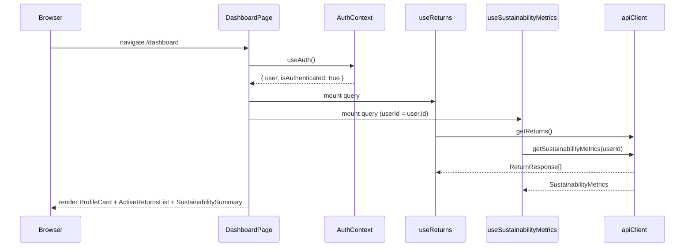
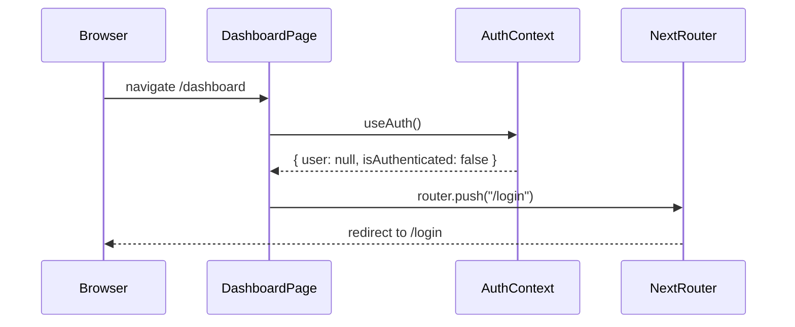
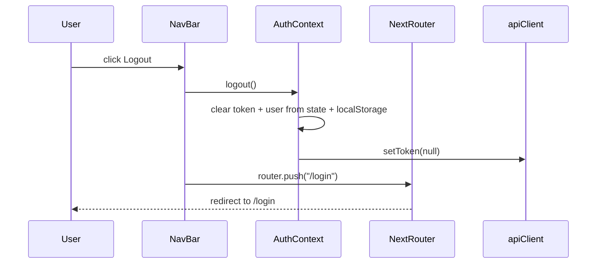

# Design Document: User Dashboard

## Overview

The User Dashboard is the authenticated landing page at `/dashboard`. After login or registration, users arrive here and see three panels rendered side-by-side: a profile card (name, email, green-credits balance), an active-returns list with status badges, and a sustainability summary (CO₂ saved, credits earned). The NavBar is also updated to read live data from `AuthContext` instead of its current hardcoded values, and gains a working Logout control.

The page follows the established async-state pattern used across every other data page in `apps/web`: `useQuery` hook → skeleton → error state → success render. Auth guarding is handled by a client-side redirect: if `useAuth()` returns no user, the page immediately pushes to `/login`.

## Architecture

```mermaid
graph TD
    A[/dashboard — DashboardPage] --> B[useAuth]
    A --> C[useReturns hook]
    A --> D[useSustainabilityMetrics hook]

    B -->|no user| E[redirect /login]
    B -->|user| F[ProfileCard component]

    C -->|isLoading| G[ReturnsSkeleton]
    C -->|isError| H[ErrorState — retry]
    C -->|data| I[ActiveReturnsList component]
    I --> J[ReturnRow — Badge + details]

    D -->|isLoading| K[SustainabilityCardSkeleton]
    D -->|isError| L[ErrorState — retry]
    D -->|data| M[SustainabilitySummary component]
    M --> N[StatCard × 2 — co2 + credits]

    O[NavBar] --> P[useAuth — user.green_credits]
    O --> Q[LogoutButton — logout + router.push /login]
```

## Sequence Diagrams

### Page Load (authenticated user)



### Unauthenticated access



### Logout flow



## Components and Interfaces

### DashboardPage (`app/dashboard/page.tsx`)

**Purpose**: Root page component for `/dashboard`. Handles auth guard, composes the three dashboard sections, and owns the page skeleton.

**Interface**:
```typescript
// No external props — page component
// Internal state driven by useAuth, useReturns, useSustainabilityMetrics
export default function DashboardPage(): JSX.Element
```

**Responsibilities**:
- Read `user` from `useAuth()`; if null, call `router.push("/login")` and return null
- Mount `useReturns()` and `useSustainabilityMetrics(user.id)` in parallel
- Render `ProfileCard`, `ActiveReturnsList`, `SustainabilitySummary` in a responsive grid
- Pass `PageHeader` with title "Dashboard" and the user's first name in the subtitle

---

### ProfileCard (`components/features/ProfileCard.tsx`) — **new component**

**Purpose**: Displays authenticated user's identity and green-credits balance.

**Interface**:
```typescript
interface ProfileCardProps {
  user: UserResponse   // { id, email, display_name, green_credits, ... }
}

export function ProfileCard({ user }: ProfileCardProps): JSX.Element
```

**Responsibilities**:
- Render `Avatar` with `AvatarFallback` showing the first letter of `display_name`
- Display `display_name` and `email`
- Show `green_credits` using a `Badge variant="success"` with the Leaf icon
- Use `Card > CardHeader > CardContent` layout
- No async data — receives hydrated `UserResponse` from parent

---

### ActiveReturnsList (`components/features/ActiveReturnsList.tsx`) — **new component**

**Purpose**: Renders the list of the user's returns with status chips. Handles its own empty state.

**Interface**:
```typescript
interface ActiveReturnsListProps {
  returns: ReturnResponse[]
}

export function ActiveReturnsList({ returns }: ActiveReturnsListProps): JSX.Element
```

**Responsibilities**:
- If `returns.length === 0`, render `EmptyState` with a Package icon, title "No active returns", and a CTA button linking to `/returns`
- For each return, render a row: `product_id` (truncated), `reason`, `created_at` (formatted date), and `ReturnStatusBadge`
- Rows are links (`<Link href={/returns/${id}}>`) so users can drill into detail
- Use `Card > CardHeader > CardContent` layout; cap visible rows at the full list (no pagination at MVP)

---

### ReturnStatusBadge (`components/features/ReturnStatusBadge.tsx`) — **new component**

**Purpose**: Maps `ReturnStatus` enum values to the correct `Badge` variant and label.

**Interface**:
```typescript
interface ReturnStatusBadgeProps {
  status: ReturnStatus
}

export function ReturnStatusBadge({ status }: ReturnStatusBadgeProps): JSX.Element
```

**Status → variant mapping**:
| ReturnStatus | Badge variant | Label |
|---|---|---|
| SUBMITTED | `info` | Submitted |
| GRADED | `info` | Graded |
| DECIDED | `warning` | Decided |
| PASSPORTED | `warning` | Passported |
| MATCHING | `warning` | Matching |
| LISTED | `success` | Listed |
| SOLD | `success` | Sold |
| FAILED | `danger` | Failed |

---

### SustainabilitySummary (`components/features/SustainabilitySummary.tsx`) — **new component**

**Purpose**: Compact two-stat summary showing the user's CO₂ avoided and green credits earned.

**Interface**:
```typescript
interface SustainabilitySummaryProps {
  totals: SustainabilityMetrics["totals"]
}

export function SustainabilitySummary({ totals }: SustainabilitySummaryProps): JSX.Element
```

**Responsibilities**:
- Render exactly two `StatCard` tiles: `co2_avoided_kg` (tone `"success"`, unit `"kg"`, Leaf icon) and `green_credits` (Award icon)
- Use `Card > CardHeader > CardContent` with a 2-column grid for the stat tiles
- Include a footer link to `/sustainability` ("View full report →")
- Does not re-fetch; receives validated `totals` from parent

---

### useReturns hook (`hooks/use-returns.ts`) — **new hook**

**Purpose**: TanStack Query hook that wraps `apiClient.getReturns()`, following the exact same pattern as `useSustainabilityMetrics`.

**Interface**:
```typescript
export const RETURNS_QUERY_KEY = ["returns"] as const

export function useReturns(): UseQueryResult<ReturnResponse[], Error>
```

**Responsibilities**:
- Call `apiClient.getReturns()` as `queryFn`
- `staleTime: 30_000`, `retry: 1` — matches existing hook conventions
- Returns standard TanStack Query result object (`data`, `isLoading`, `isError`, `error`, `refetch`)

---

### NavBar updates (`components/layout/NavBar.tsx`) — **modify existing**

**Purpose**: Replace hardcoded credits and static Avatar with live auth data, and add a Logout button.

**Changes**:
- Add `"use client"` directive (currently a Server Component — must become client to use hooks)
- Import and call `useAuth()` to get `user` and `logout`
- Replace hardcoded `150` credits badge with `user?.green_credits ?? 0`
- Replace static `AvatarFallback>U` with first letter of `user?.display_name ?? "?"`
- Add a Logout `Button` (variant `"ghost"`, small) that calls `logout()` then `router.push("/login")`
- When `user` is null (unauthenticated), hide credits badge and avatar (or show "Sign in" link)

## Data Models

### UserResponse (existing — from `types/api.ts`)

```typescript
interface UserResponse {
  id: string
  email: string
  display_name: string
  interests: string[]
  green_credits: number
  created_at: string
}
```

### ReturnResponse (existing — from `types/api.ts`)

```typescript
interface ReturnResponse {
  id: string
  product_id: string
  user_id: string
  reason: string
  status: ReturnStatus   // SUBMITTED | GRADED | DECIDED | PASSPORTED | MATCHING | LISTED | SOLD | FAILED
  media: string[]
  created_at: string
}
```

### SustainabilityMetrics["totals"] (existing — from `lib/schemas/sustainability`)

```typescript
// Relevant subset used by dashboard
{
  co2_avoided_kg: number
  green_credits: number
  waste_diverted_kg: number
  value_recovered: number
  returns_processed: number
}
```

## Key Functions with Formal Specifications

### useReturns()

**Preconditions**:
- Must be used inside a React component mounted within `QueryClientProvider`
- `apiClient` may or may not have an auth token set — mock mode works without one

**Postconditions**:
- Returns `{ data: ReturnResponse[], isLoading, isError, error, refetch }` (standard TanStack shape)
- When mocks are active (`USE_MOCKS=true`), `data` is always the static mock array — never undefined after loading
- When `isError` is true, `error.message` is a non-empty string

**Loop Invariants**: N/A (single async call)

### DashboardPage auth guard

**Preconditions**:
- `useAuth()` is available (component is inside `AuthProvider`)

**Postconditions**:
- If `user === null` after the initial render cycle: `router.push("/login")` is called exactly once, and the component returns `null`
- If `user !== null`: both `useReturns` and `useSustainabilityMetrics` queries are initiated

### NavBar logout handler

**Preconditions**:
- User is authenticated (`user !== null`)
- `logout` and `router` are available

**Postconditions**:
- `logout()` is called, which clears `slm_token` and `slm_user` from localStorage and nullifies the API token
- `router.push("/login")` is called immediately after
- The credits badge and avatar no longer display stale user data (state is cleared synchronously)

## Algorithmic Pseudocode

### Dashboard page render algorithm

```pascal
PROCEDURE DashboardPage()
  user ← useAuth().user
  router ← useRouter()

  IF user IS NULL THEN
    router.push("/login")
    RETURN null
  END IF

  returnsQuery ← useReturns()
  metricsQuery ← useSustainabilityMetrics(user.id)

  RETURN
    PageHeader(title="Dashboard", subtitle="Welcome back, " + user.display_name)
    ProfileCard(user=user)
    
    // Returns section
    IF returnsQuery.isLoading THEN ReturnsSkeleton
    ELSE IF returnsQuery.isError THEN ErrorState(onRetry=returnsQuery.refetch)
    ELSE ActiveReturnsList(returns=returnsQuery.data)
    END IF

    // Sustainability section
    IF metricsQuery.isLoading THEN SustainabilitySkeleton
    ELSE IF metricsQuery.isError THEN ErrorState(onRetry=metricsQuery.refetch)
    ELSE SustainabilitySummary(totals=metricsQuery.data.totals)
    END IF
END PROCEDURE
```

### NavBar render algorithm

```pascal
PROCEDURE NavBar()
  { user, logout } ← useAuth()
  router ← useRouter()

  creditsDisplay ← IF user IS NOT NULL THEN user.green_credits ELSE 0
  avatarInitial ← IF user IS NOT NULL THEN user.display_name[0].toUpperCase() ELSE "?"

  PROCEDURE handleLogout()
    logout()
    router.push("/login")
  END PROCEDURE

  RETURN
    Link("Amazon Second Life AI", href="/")
    NavLinks(Returns, Matches, Marketplace, Sustainability)
    
    IF user IS NOT NULL THEN
      Badge(variant="success") { creditsDisplay }
      Avatar { AvatarFallback { avatarInitial } }
      Button(variant="ghost", onClick=handleLogout) { "Log out" }
    ELSE
      Link("Sign in", href="/login")
    END IF
END PROCEDURE
```

## Example Usage

```typescript
// DashboardPage — consuming all three data sources
export default function DashboardPage() {
  const { user } = useAuth()
  const router = useRouter()
  const { data: returns, isLoading: returnsLoading, isError: returnsError, refetch: retryReturns } = useReturns()
  const { data: metrics, isLoading: metricsLoading, isError: metricsError, refetch: retryMetrics } = useSustainabilityMetrics(user?.id)

  useEffect(() => {
    if (!user) router.push("/login")
  }, [user, router])

  if (!user) return null

  return (
    <div className="container mx-auto py-8 max-w-screen-xl px-4 md:px-6">
      <PageHeader title="Dashboard" subtitle={`Welcome back, ${user.display_name}`} className="mb-8" />
      <div className="grid grid-cols-1 lg:grid-cols-3 gap-6">
        <ProfileCard user={user} />
        <div className="lg:col-span-2 space-y-6">
          {returnsLoading ? <Skeleton className="h-48 w-full rounded-xl" /> :
           returnsError  ? <ErrorState message="Could not load returns." onRetry={retryReturns} /> :
           <ActiveReturnsList returns={returns!} />}
          {metricsLoading ? <Skeleton className="h-36 w-full rounded-xl" /> :
           metricsError  ? <ErrorState message="Could not load sustainability data." onRetry={retryMetrics} /> :
           <SustainabilitySummary totals={metrics!.totals} />}
        </div>
      </div>
    </div>
  )
}
```

## Correctness Properties

*A property is a characteristic or behavior that should hold true across all valid executions of a system — essentially, a formal statement about what the system should do. Properties serve as the bridge between human-readable specifications and machine-verifiable correctness guarantees.*

### Property 1: Unauthenticated redirect is total

*For any* render of `DashboardPage` where `useAuth().user === null`, the component must call `router.push("/login")` and return null — it must never render dashboard content regardless of what other state is present.

**Validates: Requirements 1.1, 1.2**

### Property 2: ActiveReturnsList is a faithful projection of input data

*For any* non-empty array of `ReturnResponse` objects, `ActiveReturnsList` must render exactly `returns.length` rows, each containing a link to `/returns/{item.id}` and a `Return_Status_Badge` — no rows are dropped, duplicated, or rendered with the wrong id in their href.

**Validates: Requirements 2.3, 2.6**

### Property 3: Every ReturnStatus maps to a visible Badge

*For any* value in the `ReturnStatus` enum, `ReturnStatusBadge` must render a `Badge` with a non-empty label and a valid variant — no status produces an empty, undefined, or error render.

**Validates: Requirements 2.7**

### Property 4: ProfileCard is a pure display of UserResponse fields

*For any* `UserResponse` object, `ProfileCard` must render the exact `display_name`, `email`, and `green_credits` values from that object — no field may be omitted, defaulted, or transformed beyond UI formatting.

**Validates: Requirements 3.1**

### Property 5: Logout clears all persisted auth state

*For any* authenticated session (arbitrary token and user values in localStorage), calling `Auth_Context.logout()` must result in both `localStorage.getItem("slm_token")` and `localStorage.getItem("slm_user")` returning null, and `apiClient`'s internal auth token being null.

**Validates: Requirements 4.1, 4.2**

### Property 6: NavBar credits and avatar reflect live auth context

*For any* non-null `UserResponse`, the NavBar credits badge text must equal `String(user.green_credits)` and the `AvatarFallback` text must equal `user.display_name[0].toUpperCase()` — neither value may be hardcoded or stale.

**Validates: Requirements 4.4, 4.5**

### Property 7: SustainabilitySummary is a pure projection of totals

*For any* valid `SustainabilityMetrics["totals"]` object, `SustainabilitySummary` must render `co2_avoided_kg` and `green_credits` values that are numerically identical (after formatting) to the values in `totals` — no computation, rounding, or mutation occurs beyond `formatNumber`.

**Validates: Requirements 3.2**

## Error Handling

### Error Scenario 1: Returns API failure

**Condition**: `apiClient.getReturns()` rejects (network error or non-2xx)
**Response**: `useReturns` sets `isError = true`; `DashboardPage` renders `ErrorState` with the error message in the returns section
**Recovery**: User clicks "Retry" — calls `refetch()` on the returns query only; profile and sustainability sections are unaffected

### Error Scenario 2: Sustainability metrics API failure

**Condition**: `apiClient.getSustainabilityMetrics()` rejects
**Response**: `useSustainabilityMetrics` sets `isError = true`; sustainability section shows `ErrorState`
**Recovery**: Independent `refetch()` on sustainability query; returns section unaffected

### Error Scenario 3: Stale auth (token in localStorage, user null on mount)

**Condition**: `AuthProvider` restores session from localStorage on mount; between the initial render and the effect completing, `user` may briefly be null
**Response**: The auth guard uses `useEffect` + `router.push`, so the component returns null during that single render cycle and redirects — no dashboard content is ever flashed
**Recovery**: N/A — redirect is the intended recovery

### Error Scenario 4: `logout()` called while queries are in-flight

**Condition**: User clicks Logout while `useReturns` or `useSustainabilityMetrics` are still loading
**Response**: `router.push("/login")` fires; Next.js unmounts `DashboardPage`, cancelling the pending queries via TanStack Query's automatic cleanup
**Recovery**: N/A — navigation is complete

## Testing Strategy

### Unit Testing Approach

- `ReturnStatusBadge`: snapshot test for each `ReturnStatus` value to confirm variant and label
- `ProfileCard`: render with a mock `UserResponse`; assert display_name, email, and credits are visible
- `SustainabilitySummary`: render with mock totals; assert CO₂ and credits values are in the output
- `ActiveReturnsList`: render with 0 items → assert EmptyState; render with N items → assert N rows
- NavBar logout handler: mock `useAuth` and `useRouter`; simulate click → assert `logout()` called and `router.push("/login")` called

### Property-Based Testing Approach

**Property Test Library**: fast-check (already used in web app)

- **Property 1** — generate random `UserResponse` objects; assert `ProfileCard` always renders without throwing and displays `green_credits`
- **Property 2** — generate arrays of `ReturnResponse` of random length 0–50; assert `ActiveReturnsList` renders exactly that many rows
- **Property 3** — enumerate all `ReturnStatus` values; assert `ReturnStatusBadge` renders a non-empty badge for each
- **Property 5** — call `logout()` with random prior auth state; assert localStorage keys are null afterwards

### Integration Testing Approach

- Mount `DashboardPage` inside `QueryClientProvider` + `AuthProvider` with mock API; assert full render with real query lifecycle (loading → success)
- Mount with `user: null`; assert `router.push` is called with `"/login"`

## Performance Considerations

- Both `useReturns` and `useSustainabilityMetrics` use `staleTime: 30_000` — data is not re-fetched on every navigation within the session, avoiding redundant API calls
- `ProfileCard` is synchronous (no query); it renders immediately from auth context data
- Skeleton placeholders for returns and sustainability sections prevent layout shift during loading

## Security Considerations

- The auth guard runs client-side (`useEffect` → `router.push`). This is consistent with the rest of the app. The backend must still enforce auth on all API calls via Bearer token validation.
- `logout()` removes token and user from localStorage and nullifies the API client token — subsequent API calls from any mounted component will receive 401 errors, which is acceptable since the page navigates away
- `display_name` and `email` from `UserResponse` are rendered as React text nodes — no `dangerouslySetInnerHTML` is used, so XSS risk is negligible

## Dependencies

- `@tanstack/react-query` — already installed; `useQuery` for `useReturns`
- `next/navigation` — `useRouter` for redirect logic
- `lucide-react` — Leaf, Award, Package icons
- All UI primitives (`Card`, `Badge`, `Button`, `Avatar`, `Skeleton`, `EmptyState`, `ErrorState`, `StatCard`, `PageHeader`) — already in registry
- `@/lib/auth-context` — `useAuth()` hook
- `@/lib/api-client` — `apiClient.getReturns()`
- `types/api` — `UserResponse`, `ReturnResponse`
- `types/enums` — `ReturnStatus`
