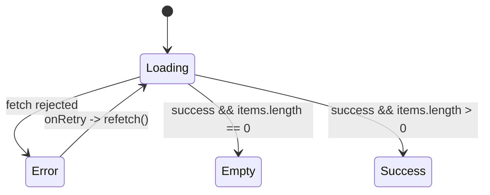

# Design Document

## Overview

This design covers build task **P3-C2** (Member C / Frontend): a polish and refinement pass
over the existing `apps/web` Next.js 14 (App Router) application so every in-scope route meets
the production bar defined in [ui-rules.md](../../../docs/ui-rules.md) — four async states on
every data view, mobile-first responsive layouts using design tokens only, and the §10
accessibility checklist — plus one concrete navigation gap (the missing **Marketplace** link
in the NavBar).

It is deliberately a *refinement* design, not a greenfield one. No new backend calls, contracts,
or Gateway routes are introduced; the frontend continues to talk to the Gateway only and uses
the existing mock layer in `api-client.ts`. The work reuses the already-built registry
components (`Skeleton`, `EmptyState`, `ErrorState`, `PageHeader`) and follows the
**`/sustainability` route (P3-C1) as the reference implementation** for correct async-state
handling — it already uses TanStack Query, renders all four states, and wires `onRetry` to
`refetch()`. Other data routes are brought up to that pattern.

### Goals

1. Add the Marketplace link to the NavBar following the exact pattern of the existing links.
2. Audit each in-scope route and close its async-state, accessibility, and responsive gaps.
3. Standardize the `ErrorState` retry on `/matches` and `/marketplace` to re-fetch data via
   TanStack Query `refetch()` instead of `window.location.reload()`.
4. Add `EmptyState` coverage to `/returns/[id]` (ungraded return) and `/passport/[id]`
   (no passport content).
5. Apply the accessibility checklist (landmarks, labeled controls, ARIA, keyboard focus,
   contrast, alt text) and verify responsiveness at 360 / 768 / 1024 px.

### Non-Goals

- No backend, contract, event, or Gateway changes (Member A/B territory).
- No new registry components — reuse and, where needed, extend existing ones.
- No redesign of the visual language; tokens and existing component patterns are fixed.
- Dark mode remains a stretch goal and is out of scope.

### Reference Pattern (`/sustainability`)

```tsx
const { data, isLoading, isError, error, refetch } = useSustainabilityMetrics()
// PageHeader always rendered
isLoading  -> <DashboardSkeleton />                       // Loading_State
isError    -> <ErrorState message={...} onRetry={() => refetch()} />  // Error_State
else       -> <Success / Empty content>                   // Success_State / Empty_State
```

Every async data route is brought to this exact shape: a TanStack Query hook supplying
`{ data, isLoading, isError, error, refetch }`, a persistent `PageHeader`, and a single
mutually-exclusive async-state branch.

## Architecture

### Scope map

```mermaid
graph TD
    subgraph Layout["components/layout"]
        NB[NavBar  +Marketplace link]
        AS[AppShell  provides main]
    end
    subgraph Routes["app/* (in scope)"]
        L[/login/]
        R[/register/]
        RET[/returns/]
        RID[/returns/[id]/]
        PID[/passport/[id]/]
        M[/matches/]
        MKT[/marketplace/]
        SUS[/sustainability  REFERENCE/]
    end
    subgraph Registry["components/features (reused)"]
        SK[Skeleton]
        ES[EmptyState]
        ERR[ErrorState]
        PH[PageHeader]
    end
    subgraph Data["lib/api-client + hooks"]
        AC[apiClient -> Gateway only]
        Q[TanStack Query hooks]
    end

    NB --> AS --> Routes
    M --> Q
    MKT --> Q
    SUS --> Q
    RID --> AC
    PID --> AC
    Q --> AC
    Routes --> Registry
```

### Route classification (from requirements Glossary)

| Route | Type | Notes |
|-------|------|-------|
| `/login` | Mutation_View | RHF + Zod, toast feedback |
| `/register` | Mutation_View | RHF + Zod, toast feedback |
| `/returns` | Mutation_View | Submit + simulated grading progress |
| `/returns/[id]` | Async_Data_View | `getReturn(id)` |
| `/passport/[id]` | Async_Data_View | `getPassport(id)` |
| `/matches` | Async_Data_View | `getMatches(returnId)` |
| `/marketplace` | Async_Data_View | `getMarketplace()` |
| `/sustainability` | Async_Data_View | **reference** (already compliant) |

### Async-state decision model

All Async_Data_Views select exactly one state. The precedence is fixed and extracted into a
single pure helper so the rule is uniform and testable (see Correctness Properties):



Precedence (highest first): **Loading → Error → Empty → Success**. `onRetry` always calls the
query's `refetch()`; it never triggers a browser reload.

## Components and Interfaces

### 1. NavBar — add Marketplace link (Requirement 1)

`apps/web/src/components/layout/NavBar.tsx`. Insert a `Marketplace` link inside the existing
`<nav>` grouping, positioned alongside Returns / Matches / Dashboard, using the identical class
string so it is visually and behaviorally indistinguishable.

```tsx
<Link href="/returns"        className="text-sm font-medium text-white hover:text-primary">Returns</Link>
<Link href="/matches"        className="text-sm font-medium text-white hover:text-primary">Matches</Link>
<Link href="/marketplace"    className="text-sm font-medium text-white hover:text-primary">Marketplace</Link>
<Link href="/sustainability" className="text-sm font-medium text-white hover:text-primary">Dashboard</Link>
```

Secondary a11y fix in the same file (Requirement 10.3): the icon-only `Avatar` trigger gains an
`aria-label` (e.g. `aria-label="User menu"`) so it has an accessible name.

### 2. Query hooks for `/matches` and `/marketplace` (Requirements 2, 5)

To match the reference pattern and supply a real `refetch()`, the two routes migrate from
manual `useEffect`/`useState` fetching to small TanStack Query hooks mirroring
`useSustainabilityMetrics`. This is the cleanest way to satisfy Requirement 5.4 (retry without
reload) while keeping the four-state branching uniform.

```ts
// hooks/use-matches.ts
export function useMatches(returnId: string) {
  return useQuery<MatchResponse[], Error>({
    queryKey: ["matches", returnId],
    queryFn: () => apiClient.getMatches(returnId),
    staleTime: 30_000,
    retry: 1,
  })
}

// hooks/use-marketplace-listings.ts
export function useMarketplaceListings() {
  return useQuery<ListingResponse[], Error>({
    queryKey: ["marketplace", "listings"],
    queryFn: () => apiClient.getMarketplace(),
    staleTime: 30_000,
    retry: 1,
  })
}
```

Route wiring (replacing `onRetry={() => window.location.reload()}`):

```tsx
const { data = [], isLoading, isError, error, refetch } = useMatches(returnId)
// ...
<ErrorState message={error?.message ?? "Failed to load matches."} onRetry={() => refetch()} />
```

For `/marketplace`, the existing client-side `Tabs` channel filtering is preserved; the query
loads once and `ListingGrid` filters in memory, so the retry control lives at the query level
and `refetch()` is passed down to each `ListingGrid`'s `ErrorState`.

### 3. Pure async-state selector (Requirement 2.5)

A single shared helper makes the four-state exclusivity rule uniform and unit/property
testable. It is pure and UI-free.

```ts
// lib/async-state.ts
export type AsyncState = "loading" | "error" | "empty" | "success"

export function selectAsyncState(input: {
  isLoading: boolean
  isError: boolean
  itemCount: number
}): AsyncState {
  if (input.isLoading) return "loading"
  if (input.isError) return "error"
  if (input.itemCount <= 0) return "empty"
  return "success"
}
```

Routes render exactly one branch based on this value. For single-object views
(`/returns/[id]`, `/passport/[id]`) `itemCount` is `0` when the resolved entity is absent /
ungraded and `1` otherwise.

### 4. EmptyState additions (Requirement 4)

**`/returns/[id]` (ungraded):** replace the ad-hoc inline `<div>…not been graded yet</div>`
with the registry `EmptyState`:

```tsx
import { ClipboardCheck } from "lucide-react"
// when returnDetail exists but returnDetail.grade is null:
<EmptyState
  icon={ClipboardCheck}
  title="Not graded yet"
  description="This return hasn't been graded by the AI inspector yet. Check back shortly."
/>
```

**`/passport/[id]` (no content):** replace `if (!passport) return null` with an `EmptyState`
so the screen never renders blank:

```tsx
import { FileSearch } from "lucide-react"
if (!passport) {
  return (
    <div className="container mx-auto py-8 max-w-screen-xl px-4 md:px-6">
      <PageHeader title="Digital Product Passport" subtitle="" />
      <EmptyState
        icon={FileSearch}
        title="No passport found"
        description="We couldn't find passport details for this product."
      />
    </div>
  )
}
```

### 5. Mutation views feedback (Requirement 6)

`/login`, `/register`, `/returns` already disable the submit button while pending, show a
pending label (and a `Progress` bar on `/returns`), and surface success/failure via `useToast`
with the human-readable envelope `message`. The audit confirms these and adds the missing
`aria-describedby` wiring (see §6 below).

### 6. Accessibility wiring (Requirements 9–13)

- **Landmarks (9):** `AppShell` already wraps content in a single `<main>`; `NavBar` already
  uses `<header>`/`<nav>`. Per-route fix is heading order — ensure `PageHeader`/`CardTitle`
  render a single descending heading hierarchy (one `h1` per route, no skipped levels).
- **Labeled controls + ARIA (10):** `login`/`register` inputs are labeled but their error `<p>`
  is not linked. Add `aria-describedby` + `aria-invalid` on the `Input` when an error is
  present, pointing at the existing error element `id` (`email-error`, `password-error`,
  `displayName-error`). Icon-only controls (NavBar avatar) get `aria-label`; decorative lucide
  icons get `aria-hidden` (already true in `EmptyState`/`ErrorState`).
- **Keyboard + focus (11):** rely on the registry primitives' `ring` focus styles and Radix
  focus-trap/Esc behavior in `Select`/`Dialog`/`Tabs`; verify nothing strips them.
- **Contrast + non-color cues (12):** keep body copy at or above `text-muted-foreground`;
  ensure grade/status meaning is paired with text (already via `GradeBadge showLabel` and the
  capitalized status text on `/passport/[id]`).
- **Alt text (13):** `ProductCard` uses `next/image`; pass `alt={product.title}` and keep the
  `bg-muted` placeholder for the absent/failed image case (marketplace mocks pass
  `image: undefined`).

## Data Models

No new data models are introduced. The design consumes existing response types from
`apps/web/types/api.ts` and the existing mock layer. The only new *types* are UI-internal:

```ts
// lib/async-state.ts
type AsyncState = "loading" | "error" | "empty" | "success"

// hook return shapes (TanStack Query UseQueryResult)
UseQueryResult<MatchResponse[], Error>     // useMatches
UseQueryResult<ListingResponse[], Error>   // useMarketplaceListings
```

Existing consumed shapes (unchanged): `MatchResponse[]`, `ListingResponse[]`,
`ReturnDetailResponse` (with optional `grade` / `decision`), `PassportResponse` (with optional
`timeline`).

## Per-Route Audit

Each in-scope route, the gaps found against ui-rules.md §5/§10 and the requirements, and the
fix. `/sustainability` is the reference and needs no change.

| Route | Type | Gaps found | Fix | Requirements |
|-------|------|-----------|-----|--------------|
| `/login` | Mutation_View | Error `<p>` not linked to input via `aria-describedby`/`aria-invalid`; heading is `CardTitle` not a page `h1`. Pending/disabled/toast OK. | Add `aria-describedby={errors.email && "email-error"}` + `aria-invalid` to each `Input`; confirm single descending heading. | 6.1–6.4, 9.3, 10.1, 10.2, 11.2, 12.1 |
| `/register` | Mutation_View | Same `aria-describedby` gap on 3 inputs (name/email/password). Pending/disabled/toast OK. | Add `aria-describedby`/`aria-invalid` wiring on all three inputs. | 6.1–6.4, 9.3, 10.1, 10.2, 12.1 |
| `/returns` | Mutation_View | Pending (Progress), disabled submit, toasts all present. Minor: ensure FileUpload remove buttons have labels and heading order. | Verify icon-only remove control `aria-label`; confirm heading order. No state-machine change. | 6.1–6.4, 10.1, 10.3, 11.1 |
| `/returns/[id]` | Async_Data_View | Loading skeleton ✅ and error→`refetch` (`fetchDetail`) ✅ already correct. **Missing**: ungraded case uses ad-hoc inline div, not `EmptyState`. | Replace inline "not graded" div with registry `EmptyState`; keep skeleton + ErrorState. | 2.1–2.5, 3.1, 4.1–4.3, 5.1–5.4, 9.2, 9.3 |
| `/passport/[id]` | Async_Data_View | Loading skeleton ✅ and error→`refetch` (`fetchPassport`) ✅. **Missing**: `if (!passport) return null` renders nothing instead of an empty state. Inline status pill uses raw ARIA-less span. | Replace `return null` with `EmptyState`; confirm status conveyed by text (non-color). | 2.1–2.5, 3.1, 4.1, 4.4, 5.1–5.4, 9.2, 12.3 |
| `/matches` | Async_Data_View | All four states present BUT `onRetry={() => window.location.reload()}` — **violates 5.4**. Manual `useEffect` fetch, no `refetch`. | Migrate to `useMatches` TanStack Query hook; `onRetry={() => refetch()}`. Keep skeleton/Empty/Success. | 2.1–2.5, 3.1, 3.2, 4.1, 4.2, 5.1–5.4, 7.1–7.4 |
| `/marketplace` | Async_Data_View | Four states present (in `ListingGrid`) BUT `onRetry={() => window.location.reload()}` — **violates 5.4**. Manual `useEffect` fetch. `ProductCard` image `undefined` needs alt + placeholder. | Migrate to `useMarketplaceListings`; pass `refetch` into `ListingGrid` for `onRetry`. Set `alt={title}` + keep placeholder. Preserve Tabs filtering. | 2.1–2.5, 3.1, 4.1, 5.1–5.4, 7.1–7.4, 13.1, 13.2 |
| `/sustainability` | Async_Data_View | None — reference pattern (TanStack Query, four states, `refetch`). | No change. | 2.x, 3.x, 4.x, 5.x (reference) |

### Cross-cutting findings

- **Double container/padding:** `AppShell` already applies `max-w-screen-xl px-4 md:px-6 lg:px-8`
  *and* each route re-wraps in `container mx-auto … px-4 md:px-6`. This is harmless but
  redundant; the audit standardizes inner wrappers to `space-y-8` content containers and lets
  AppShell own the page gutter where practical. No token violations, so this is cleanup, not a
  blocking fix.
- **Responsive:** existing grids already use `grid-cols-1 sm: md: lg:` token classes
  (matches/marketplace/passport). Verification is at 360/768/1024 with no horizontal overflow
  (Requirement 7); no raw px/hex literals were found in the in-scope routes (Requirement 8).

## Correctness Properties

*A property is a characteristic or behavior that should hold true across all valid executions
of a system — essentially, a formal statement about what the system should do. Properties serve
as the bridge between human-readable specifications and machine-verifiable correctness
guarantees.*

This feature is predominantly UI refinement (rendering, semantic structure, ARIA, keyboard,
contrast, responsive layout). Per ui-rules.md and the PBT guidance, those criteria are validated
with React Testing Library, `jest-axe`, and snapshot/visual checks rather than property-based
testing. The prework analysis identified **exactly one** criterion that is a genuine universal
invariant over a pure function and is therefore appropriate for property-based testing: the
async-state mutual-exclusivity and precedence rule (Requirement 2.5), realized via the pure
`selectAsyncState` helper.

### Property 1: Async views resolve to exactly one correct state

*For any* combination of query inputs `{ isLoading, isError, itemCount }`, `selectAsyncState`
returns exactly one value from `{ "loading", "error", "empty", "success" }`, and that value
follows the fixed precedence: `loading` when loading; otherwise `error` when errored; otherwise
`empty` when `itemCount <= 0`; otherwise `success`.

**Validates: Requirements 2.5** (and underpins 2.1, 2.2, 2.3, 2.4)

## Error Handling

- **Fetch failures (Async_Data_Views):** TanStack Query (or the existing try/catch on
  `/returns/[id]` and `/passport/[id]`) surfaces a rejected state. The route renders
  `ErrorState` with the human-readable envelope `message` (never a raw `Error`/stack —
  Requirement 5.2) and an `onRetry` that calls `refetch()` (or the route's `fetchDetail`/
  `fetchPassport`) — never `window.location.reload()` (Requirement 5.4).
- **Empty results:** a successful fetch with zero items (or an absent/ungraded single entity)
  renders `EmptyState` with a `title` and descriptive message (Requirement 4).
- **Mutation failures (`/login`, `/register`, `/returns`):** caught and surfaced via `useToast`
  with `variant: "destructive"` and the envelope `message`; the submit control re-enables
  (Requirements 6.1, 6.4).
- **Validation errors:** Zod + React Hook Form produce field messages; the message element is
  linked to its input via `aria-describedby` with `aria-invalid` (Requirement 10.2).
- **Image load failure / absence:** `ProductCard` renders its `bg-muted` placeholder and a
  meaningful `alt` (Requirement 13.2).
- The `api-client` continues to normalize Gateway errors into a single `Error(message)` from the
  error envelope, so no UI surface receives a raw object.

## Testing Strategy

### Unit / component tests (React Testing Library + jest-axe)

Primary mechanism for this feature. For each in-scope route and the NavBar:

- **NavBar (Req 1):** assert a link with `href="/marketplace"`, accessible name `Marketplace`,
  the shared class string, and placement within the `<nav>`.
- **Four states (Req 2–5):** for `/matches`, `/marketplace`, `/returns/[id]`, `/passport/[id]`,
  mock the query/`apiClient` in each of loading / empty / error / success and assert the correct
  single branch renders (`Skeleton` / `EmptyState` / `ErrorState` / content).
- **Retry without reload (Req 5.4):** render the error branch of `/matches` and `/marketplace`,
  click **Retry**, assert the query function is re-invoked (call count increments) and
  `window.location.reload` is never called (spy asserts not-called).
- **EmptyState additions (Req 4.3, 4.4):** `/returns/[id]` with `grade: null` renders the
  "Not graded yet" `EmptyState`; `/passport/[id]` with no passport renders the "No passport
  found" `EmptyState` (not `null`).
- **Mutation feedback (Req 6):** submit `/login` and `/register`; assert disabled button +
  pending label while pending, success toast on resolve, human-readable failure toast on reject.
- **Accessibility (Req 9–13):** run `jest-axe` on each route (landmarks, label associations,
  heading order, image-alt, color-contrast); assert `aria-describedby`/`aria-invalid` appear on
  errored inputs; assert icon-only controls expose an accessible name and decorative icons are
  `aria-hidden`.

### Responsive checks (Req 7)

Verify each route at 360 / 768 / 1024 px with no horizontal overflow of the page body —
manual verification plus optional Playwright viewport snapshots. No automated property test.

### Static / smoke checks (Req 8, 12.2)

`npm run lint` plus a grep over in-scope files for raw hex (`#`) and arbitrary pixel
(`[NNpx]`) literals to enforce tokens-only styling; confirm body copy is not dimmed below
`muted-foreground`.

### Property-based test (Req 2.5)

A single property-based test backs **Property 1**, using a property-testing library for the
TypeScript/React stack (**fast-check** with Vitest/Jest). It is the only PBT in this feature.

- Generate random `{ isLoading: boolean, isError: boolean, itemCount: integer (incl. 0 and
  negatives) }`.
- Assert `selectAsyncState(input)` is a member of the four-element set, and equals the value
  dictated by the precedence rule (independently recomputed in the assertion).
- Minimum **100 iterations**.
- Tag the test:
  `// Feature: frontend-polish-a11y, Property 1: Async views resolve to exactly one correct state`

### Definition of Done alignment

Per AGENTS.md: `npm run lint && npm run build` pass; UI uses tokens + registry components only;
no new backend calls; `docs/ui-registry.md` NavBar row updated to note the Marketplace link; and
`docs/progress-tracker.md` updated marking P3-C2.
