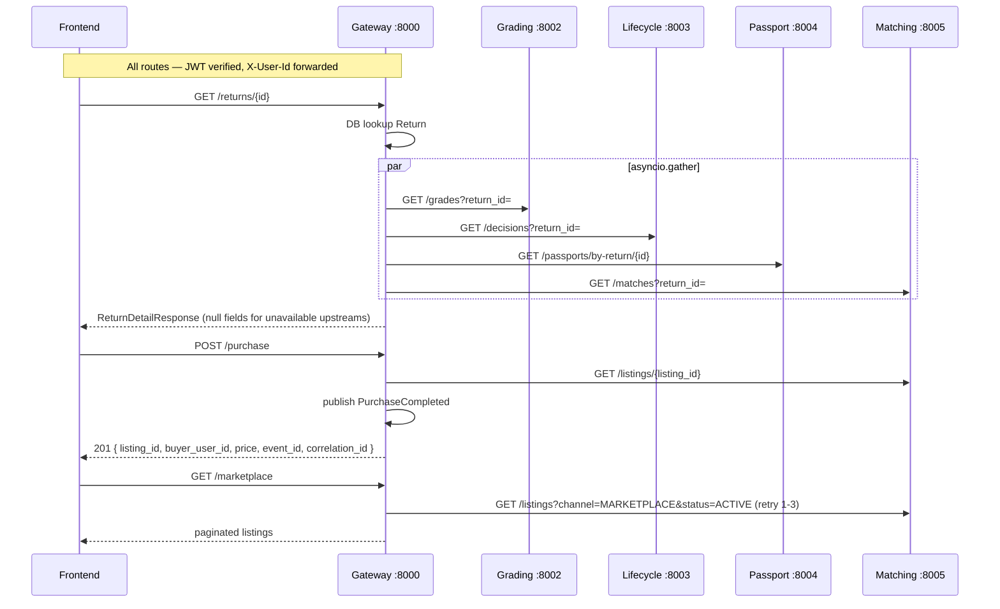

# Design Document — P2-A2: Gateway Aggregation + PurchaseCompleted

## Overview

This document describes the technical design for extending the API Gateway's BFF layer
(P2-A2). The gateway already handles auth-proxy and return creation (P1-A2). This feature
completes the BFF surface by:

1. **Enriching `GET /returns/{id}`** — concurrent fan-out to four upstream services with
   partial-availability fallback.
2. **Adding proxy routes** — `GET /passports/{id}` and `GET /matches?return_id=` as thin
   transparent proxies.
3. **Adding `POST /purchase`** — listing-ID lookup → `PurchaseCompleted` event publish.
4. **Adding `GET /marketplace`** — filtered proxy to the Matching Service with retry and
   back-off.

All five routes sit behind the existing `get_current_user_id` dependency. The changes are
**additive**: no existing route signature changes.

### Key design goals

- **Single round-trip for the frontend** — the detail page gets grade + decision + passport +
  matches in one HTTP call.
- **Resilience over completeness** — a slow or down upstream degrades the response (null
  fields) rather than failing it.
- **Reusable ServiceClient** — one per-service method on the existing `ServiceClient` class;
  no duplicate `httpx` wiring.
- **Event correctness** — `PurchaseCompleted` payload is validated by the existing shared
  envelope schema before publish.

---

## Architecture

### Request flow



### Component placement

All new code sits within `services/gateway/` following the existing layered structure:

```
services/gateway/app/
├── api/
│   ├── routes.py          ← extend with 5 new route handlers
│   └── middleware.py      ← unchanged (get_current_user_id, require_auth)
├── clients/
│   └── http_client.py     ← extend ServiceClient with per-service methods
└── domain/
    └── schemas.py         ← add PurchaseRequest, PurchaseResponse, new proxy DTOs
```

No new files required — all additions extend existing modules.

---

## Components and Interfaces

### 1. ServiceClient (`app/clients/http_client.py`)

The existing `ServiceClient` exposes a generic `call_service()` method and one
`proxy_to_user_service()` specialisation. We add five new methods following the same
pattern. Each method accepts `user_id: str` and builds the `X-User-Id` header
automatically.

```
ServiceClient
├── call_service(method, url, *, json, params, headers) -> dict   [existing]
├── proxy_to_user_service(method, path, *, json, headers) -> dict  [existing]
│
│   ── new methods ──────────────────────────────────────────────────────
├── get_grade(return_id, user_id) -> dict | None
│     GET {grading_url}/grades?return_id={return_id}
│     Swallows 404 / ConnectError → returns None
│
├── get_decision(return_id, user_id) -> dict | None
│     GET {lifecycle_url}/decisions?return_id={return_id}
│     Swallows 404 / ConnectError → returns None
│
├── get_passport_by_return(return_id, user_id) -> dict | None
│     GET {passport_url}/passports/by-return/{return_id}
│     Swallows 404 / ConnectError → returns None
│
├── get_matches(return_id, user_id) -> list[dict]
│     GET {matching_url}/matches?return_id={return_id}
│     Swallows 404 / ConnectError → returns []
│
├── get_passport(passport_id, user_id) -> dict
│     GET {passport_url}/passports/{passport_id}
│     Raises AppError(502) on ConnectError, re-raises 404 as AppError(404)
│
├── get_matches_for_return(return_id, user_id) -> dict
│     GET {matching_url}/matches?return_id={return_id}
│     Raises AppError on errors (strict proxy mode)
│
├── get_listing(listing_id, user_id) -> dict
│     GET {matching_url}/listings/{listing_id}
│     Raises AppError(404) on 404, AppError(502) on ConnectError
│
└── get_marketplace(params: dict, user_id) -> dict
      GET {matching_url}/listings?channel=MARKETPLACE&status=ACTIVE&...
      Called by _marketplace_with_retry(); raises on all errors
```

**Partial-availability helpers** — The aggregation methods (`get_grade`, `get_decision`,
`get_passport_by_return`, `get_matches`) use a shared private helper:

```python
async def _safe_call(self, coro, *, default):
    """
    Await coro; return default on 404 or ConnectError.
    All other exceptions propagate.
    """
```

This keeps the `asyncio.gather` call in the route handler clean: each gather task is already
wrapped in `_safe_call`, so a failure in one never cancels the others.

**Retry with back-off** — The marketplace route uses a separate helper:

```python
async def _marketplace_with_retry(self, params: dict, user_id: str) -> dict:
    """
    Attempt GET /listings?channel=MARKETPLACE&status=ACTIVE up to 3 times.
    Back-off: attempt 1→0s, attempt 2→1s, attempt 3→2s (exponential, capped at 2s).
    Logs each failure at WARNING with correlation_id.
    Raises AppError(502, "upstream_unreachable") after all retries exhausted.
    """
```

No external retry library is needed; the back-off is a simple `asyncio.sleep` loop.

---

### 2. Route handlers (`app/api/routes.py`)

#### `GET /returns/{return_id}` — BFF aggregation (replaces stub)

```
1. require_auth(user_id)
2. DB: fetch Return by return_id  →  404 if not found
3. asyncio.gather([
       client.get_grade(return_id, user_id),
       client.get_decision(return_id, user_id),
       client.get_passport_by_return(return_id, user_id),
       client.get_matches(return_id, user_id),
   ])
4. Build ReturnDetailResponse:
       return_data = ReturnResponse.from_orm(return_entity)
       grade       = grade_result (None if upstream failed)
       decision    = decision_result (None if upstream failed)
       passport    = passport_result (None if upstream failed)
       matches     = matches_result ([] if upstream failed)
5. Return 200
```

The `asyncio.gather` call uses `return_exceptions=False` (default). Exceptions are already
suppressed inside each `_safe_call` wrapper, so gather never sees exceptions from the four
partial-availability calls.

#### `GET /passports/{passport_id}` — strict proxy

```
1. require_auth(user_id)
2. client.get_passport(passport_id, user_id)
   → 404 from upstream  →  re-raise AppError(404)
   → ConnectError        →  AppError(502, "upstream_unreachable")
3. Return 200 with upstream body unchanged
```

#### `GET /matches` — strict proxy

```
1. require_auth(user_id)
2. Validate return_id query param present  →  422 if absent
3. client.get_matches_for_return(return_id, user_id)
   → 404 from upstream  →  re-raise AppError(404)
   → ConnectError        →  AppError(502, "upstream_unreachable")
4. Return 200 with upstream body unchanged
```

#### `POST /purchase`

```
1. require_auth(user_id)
2. Validate buyer_user_id == user_id (JWT-derived)  →  403 if mismatch
3. client.get_listing(request.listing_id, user_id)
   → 404  →  AppError(404)
4. correlation_id = listing["return_id"]
5. event_id = await publish(
       event_type="PurchaseCompleted",
       correlation_id=correlation_id,
       data={
           "listing_id": request.listing_id,
           "product_id": listing.get("product_id", ""),
           "return_id": correlation_id,
           "buyer_user_id": user_id,
           "price": request.price,
       },
       redis_url=settings.redis_url,
       producer="gateway",
   )
   → Exception  →  AppError(503, "event_publish_failed")
6. Return 201: PurchaseResponse
```

> **buyer_user_id override**: The `buyer_user_id` in the event is **always** taken from the
> JWT-derived `user_id`, not from the request body, enforcing requirement 4.7. The request
> body field is validated to match; a mismatch returns 403.

#### `GET /marketplace`

```
1. require_auth(user_id)
2. Resolve defaults: limit = limit or 20, offset = offset or 0
3. Build params: {channel: MARKETPLACE, status: ACTIVE, limit, offset, ...category}
4. client._marketplace_with_retry(params, user_id)
   → AppError(502) after 3 attempts
5. Return 200 with upstream body unchanged
```

---

### 3. Schemas (`app/domain/schemas.py`)

New DTOs added (no changes to existing schemas):

```python
class PurchaseRequest(BaseModel):
    listing_id: str
    buyer_user_id: str     # must equal JWT user_id; validated in route
    price: float = Field(..., gt=0)

class PurchaseResponse(BaseModel):
    listing_id: str
    buyer_user_id: str
    price: float
    event_id: str
    correlation_id: str
```

The proxy routes (`/passports/{id}`, `/matches`, `/marketplace`) return the upstream JSON
body as-is using `JSONResponse`; no new Pydantic DTOs needed for those responses.

---

## Data Models

No new database tables. The Gateway continues to own only the `Return` table.

The `PurchaseCompleted` event payload is defined in `shared_py/events/schemas.py` as
`PurchaseCompletedEventData`:

```python
class PurchaseCompletedEventData(BaseModel):
    listing_id: str
    product_id: str
    return_id: str
    buyer_user_id: str
    price: float
```

The `publish()` function validates the `data` dict against this model before writing to
Redis — this is an existing shared-py guarantee, no new validation code needed in the route.

### Header propagation contract

Every upstream call from the gateway includes:

| Header | Source | Purpose |
|---|---|---|
| `X-User-Id` | JWT `sub` claim | Downstream auth |
| `X-Correlation-Id` | `return_id` / `listing_id` | Distributed tracing |

`X-Correlation-Id` is passed when the gateway has a `return_id` or `listing_id` in scope.

---

## Correctness Properties

*A property is a characteristic or behavior that should hold true across all valid executions
of a system — essentially, a formal statement about what the system should do. Properties serve
as the bridge between human-readable specifications and machine-verifiable correctness
guarantees.*

**Property Reflection** — After reviewing all prework items, the following redundancies were
identified and consolidated:

- Criteria 1.5, 2.4, 3.5 all test "X-User-Id is forwarded" — merged into one property (P2)
  parameterized over routes.
- Criteria 4.1 and 4.5 both describe the PurchaseCompleted round-trip — merged into P4.
- Criteria 7.1-7.3 (ErrorEnvelope structure) are implicitly validated by every negative-path
  test; not a standalone property test.
- Criteria 5.2 (limit/offset forwarding) is subsumed by P5 (marketplace fixed-filter
  property).

---

### Property 1: Partial upstream failure does not fail the aggregated response

*For any* non-empty subset of {Grading, Lifecycle, Passport, Matching} services that return
4xx or are unreachable, `GET /returns/{id}` SHALL still return HTTP 200. The fields
corresponding to the failed services SHALL be `null` (scalar) or `[]` (list), and the fields
from available services SHALL contain valid data.

**Validates: Requirements 1.3**

---

### Property 2: X-User-Id is forwarded to every upstream call on authenticated routes

*For any* valid user identity (any `user_id` string derived from a verified JWT), every
outbound HTTP call made by the gateway on behalf of that request SHALL carry an `X-User-Id`
header whose value equals that `user_id`. This holds for the aggregation fan-out (four
services), the passport proxy, the matches proxy, the listing lookup, and the marketplace
proxy.

**Validates: Requirements 1.5, 2.4, 3.5, 6.3**

---

### Property 3: Missing Return produces 404 for any unknown return_id

*For any* UUID string that does not correspond to a `Return` row in the Gateway database,
`GET /returns/{id}` SHALL return HTTP 404 with an ErrorEnvelope. No upstream service calls
SHALL be made.

**Validates: Requirements 1.4**

---

### Property 4: PurchaseCompleted event is a faithful round-trip of the request inputs

*For any* valid combination of `listing_id`, `price`, and authenticated `user_id`, when
`POST /purchase` succeeds:

- The published event envelope SHALL have a non-null `event_id` (UUID), `event_type ==
  "PurchaseCompleted"`, and `correlation_id` equal to the `return_id` retrieved from the
  listing.
- The `data` sub-object SHALL contain `listing_id`, `buyer_user_id`, and `price` exactly
  equal to the request inputs (with `buyer_user_id` equal to the JWT `user_id`).
- The HTTP 201 response body SHALL contain those same five fields plus `event_id` and
  `correlation_id`.

No input value is dropped, transformed, or substituted when the event is assembled.

**Validates: Requirements 4.1, 4.5, 4.7, 8.5**

---

### Property 5: Marketplace proxy always appends fixed channel and status filters

*For any* combination of optional query parameters (`category`, `limit`, `offset`) passed to
`GET /marketplace`, the outbound URL to the Matching Service SHALL always include
`channel=MARKETPLACE` and `status=ACTIVE`, in addition to any caller-supplied parameters.
No caller-supplied parameters SHALL be dropped or altered.

**Validates: Requirements 5.1, 5.2, 5.4**

---

## Error Handling

All error responses use `AppError` (raises `shared_py.web.errors.AppError`), which is
converted to the `ErrorEnvelope` shape by the shared exception handler already registered in
`create_app()`.

| Scenario | Status | `code` |
|---|---|---|
| Return not found | 404 | `not_found` |
| Upstream 404 on proxy routes | 404 | `not_found` |
| Upstream unreachable (connect error) | 502 | `upstream_unreachable` |
| Redis / event publish failure | 503 | `event_publish_failed` |
| Listing not found (`POST /purchase`) | 404 | `not_found` |
| Missing `return_id` param (`GET /matches`) | 422 | `validation_error` |
| `buyer_user_id` ≠ JWT user_id | 403 | `forbidden` |
| No JWT / invalid JWT | 401 | `unauthenticated` |
| Marketplace all retries exhausted | 502 | `upstream_unreachable` |

`correlation_id` in the ErrorEnvelope is populated with the path param (`return_id`,
`passport_id`) when available, and `""` otherwise (per requirement 7.3).

### Partial availability detail (`GET /returns/{id}`)

The four gather tasks are wrapped in `_safe_call`. The suppress condition is:

- `AppError` with `status_code == 404` (upstream returned not-found)
- `httpx.RequestError` (connection refused, timeout, DNS failure)

Any other exception (e.g. a 500 from an upstream, a JSON decode error) is **not** suppressed
and will propagate to a 502, because that indicates a bug rather than expected unavailability.

### Retry strategy (`GET /marketplace`)

```
attempt 1: immediate
attempt 2: sleep 1s
attempt 3: sleep 2s
→ all exhausted: AppError(502, "upstream_unreachable")
```

Each failed attempt is logged at `WARNING` with `correlation_id` (using the request's
path-derived or generated UUID) and the attempt number.

---

## Testing Strategy

### Dual testing approach

- **Unit / example tests**: concrete scenarios (happy path, each error path, retry count).
- **Property-based tests**: universal properties using `hypothesis` for the five properties
  defined above.

`hypothesis` is listed under Part D (new library). It is the standard PBT library for
Python and requires no AWS or network access. Each test uses `@given` + `@settings(max_examples=100)`.

### New test file: `tests/test_aggregation.py`

Covers the five new route groups plus the PBT properties.

#### Happy-path examples (one per route)

```
test_get_return_detail_aggregated_success
  - All four upstreams return valid mock data
  - Assert 200, all five top-level fields present, each field sourced from correct upstream

test_get_passport_success
  - Passport_Service returns 200 with mock body
  - Assert 200, body unchanged

test_get_matches_success
  - Matching_Service returns 200 with mock body
  - Assert 200, body unchanged

test_post_purchase_success
  - Listing lookup returns valid listing
  - publish() called with correct envelope
  - Assert 201, PurchaseResponse fields match

test_get_marketplace_success
  - Matching_Service returns paginated listings on first attempt
  - Assert 200, body unchanged
```

#### Error-path examples (502 and 404 per route)

```
test_get_return_detail_not_found        (Return not in DB → 404)
test_get_passport_not_found             (Passport_Service 404 → 404)
test_get_passport_unreachable           (ConnectError → 502 + code)
test_get_matches_missing_param          (no return_id → 422)
test_get_matches_unreachable            (ConnectError → 502 + code)
test_post_purchase_listing_not_found    (listing 404 → 404, no event)
test_post_purchase_event_publish_fail   (publish raises → 503 + code)
test_get_marketplace_all_retries_fail   (3 × ConnectError → 502 + code, 3 calls)
```

#### Property-based tests

```python
# Property 1: partial upstream failure still returns 200
@given(failing=st.frozensets(st.sampled_from(["grading","lifecycle","passport","matching"]),
                              min_size=1))
@settings(max_examples=100)
async def test_partial_upstream_failure_returns_200(failing):
    # Mock each service in `failing` to raise ConnectError or 404
    # Assert: response.status_code == 200
    # Assert: failed fields are null or []
    # Assert: available fields are non-null

# Property 2: X-User-Id forwarded on all routes
@given(user_id=st.text(min_size=1, max_size=64, alphabet=st.characters(whitelist_categories=("L","N"))))
@settings(max_examples=100)
async def test_x_user_id_forwarded_aggregation(user_id):
    # Mock all upstreams to capture headers
    # Assert all four captured requests have X-User-Id == user_id

# Property 3: unknown return_id always 404
@given(return_id=st.uuids().map(str))
@settings(max_examples=100)
async def test_unknown_return_id_returns_404(return_id):
    # DB is empty; call GET /returns/{return_id}
    # Assert 404 + ErrorEnvelope structure

# Property 4: PurchaseCompleted round-trip
@given(
    listing_id=st.uuids().map(str),
    price=st.floats(min_value=0.01, max_value=10000.0, allow_nan=False),
    user_id=st.uuids().map(str),
)
@settings(max_examples=100)
async def test_purchase_completed_round_trip(listing_id, price, user_id):
    # Mock listing lookup to return {return_id: <uuid>, product_id: <uuid>}
    # Mock publish to capture envelope
    # Assert event envelope: event_type == "PurchaseCompleted"
    # Assert event data: listing_id, buyer_user_id == user_id, price match inputs
    # Assert 201 response body: listing_id, buyer_user_id, price, event_id, correlation_id

# Property 5: marketplace always appends fixed filters
@given(
    category=st.one_of(st.none(), st.text(min_size=1, max_size=32)),
    limit=st.one_of(st.none(), st.integers(min_value=1, max_value=100)),
    offset=st.one_of(st.none(), st.integers(min_value=0, max_value=1000)),
)
@settings(max_examples=100)
async def test_marketplace_fixed_filters(category, limit, offset):
    # Mock Matching_Service to capture URL
    # Assert captured URL contains channel=MARKETPLACE and status=ACTIVE
    # Assert limit defaults to 20 when None, offset defaults to 0 when None
    # Assert other params forwarded unchanged
```

#### Mock strategy

All upstream calls are mocked via `pytest-httpx` (`pytest_httpx.HTTPXMock`) or
`unittest.mock.AsyncMock` on `service_client` methods, consistent with the existing
`conftest.py` pattern. No real service connections are required. `publish()` is mocked via
`monkeypatch` (same as `mock_publish` in the existing conftest).

**Tag format for property tests** (per testing strategy):

```python
# Feature: gateway-aggregation, Property 1: partial upstream failure returns 200
# Feature: gateway-aggregation, Property 2: X-User-Id forwarded on all routes
# Feature: gateway-aggregation, Property 3: unknown return_id always 404
# Feature: gateway-aggregation, Property 4: PurchaseCompleted round-trip
# Feature: gateway-aggregation, Property 5: marketplace fixed filters
```

Minimum 100 iterations per property test (`@settings(max_examples=100)`).

### New dependency

`hypothesis>=6.111,<7` is needed for property-based tests and must be added to
`services/gateway/pyproject.toml` under `[project.optional-dependencies] dev`.
