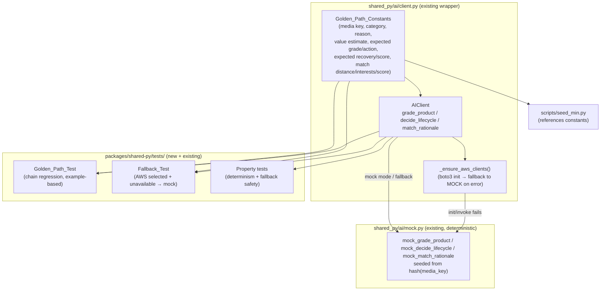

# Design Document

## Overview

Task **P3-B2 — Golden-path demo product + AI fallback test** locks in the judge demo by adding
two guarantees on top of the already-built shared AI wrapper (`packages/shared-py/shared_py/ai/`):

1. **Determinism** — the golden-path demo product produces the EXACT same
   grade → decision → match → sustainability chain on every mock-mode run, so a regression is
   caught automatically before the judges ever see it.
2. **Fallback safety** — when `AI_MODE=aws`/`hybrid` is selected but Bedrock/Rekognition are
   unreachable (or keys are absent), the wrapper silently degrades to mock and the golden-path
   chain still completes with no crash and no propagated exception.

This feature adds **no new service code** and **no new endpoints**. It is a demo-safety,
test-and-lock-in task. The deliverables are:

- A small set of **locked golden-path constants** added to `shared_py/ai/client.py` (extending the
  existing `GOLDEN_PATH_MEDIA_KEY` / `GOLDEN_PATH_CATEGORY` / `GOLDEN_PATH_REASON`) and re-exported
  from `shared_py/ai/__init__.py`.
- Two new tests in `packages/shared-py/tests/`: a **Golden_Path_Test** (chain regression) and a
  **Fallback_Test** (graceful degradation), plus property-based tests for determinism and fallback
  safety.
- **Seed alignment** in `scripts/seed_min.py` (reference the constants; keep the seeded
  original price consistent with the locked RESELL decision).
- A **docs update** to `docs/progress-tracker.md` per the Definition of Done.

### Critical established fact (drives the constants)

The golden-path media key `products/golden-path/demo-headphones-001.jpg` hashes (md5, first 8 hex
digits) to mock bucket **57**, which `_grade_from_seed` maps to **Grade B** (range 35–64). In
`mock_decide_lifecycle`, the `Grade.B` branch returns **RESELL** *only when* `value_estimate > 50`;
at `value_estimate <= 50` it returns **REFURBISH**. The hyperlocal override
(`_hash_input(f"{grade}{product_category}") % 5 == 0`) does **not** fire for `Grade.B` + `electronics`
(it computes to mod-5 = 4). Therefore the golden-path value estimate passed to `decide_lifecycle`
**must be pinned above 50.0** for the locked RESELL result documented in `context/AI.md` §12.

## Architecture

Nothing about the runtime architecture changes. The work sits entirely in the shared-py AI package
and its test suite. The relationship between the locked constants, the existing (unchanged) wrapper,
and the new tests:



### Where the constants live

The new constants live next to the existing golden-path constants in
`shared_py/ai/client.py` and are re-exported from `shared_py/ai/__init__.py`. This keeps a single
source of truth that both the tests and `scripts/seed_min.py` import — satisfying the
"pinned in one place, cannot drift silently" goal (Requirement 1). `scripts/seed_min.py` already
imports the three existing constants from `shared_py.ai.client`; it will additionally consume the
value-estimate constant.

### Fallback simulation strategy

Requirement 7.5 mandates that AWS unavailability be induced by **AWS client initialization or
invocation failure**, never by setting `AIMode.MOCK` directly. The wrapper has two natural seams:

1. **Initialization failure** — `_ensure_aws_clients()` does `import boto3` then
   `boto3.client(...)`. Patching `boto3.client` to raise makes `_ensure_aws_clients()` hit its
   `except` branch, log a warning, and set `self.mode = AIMode.MOCK`. Subsequent calls take the
   mock path. This drives Requirements 6.1 and 6.2.
2. **Invocation failure** — let `boto3.client(...)` return a stub whose `converse` /
   `detect_labels` / `detect_moderation_labels` raise. The mode stays `AWS`, the `_aws_*` path runs,
   the inner call raises, and each public method's outer `try/except` returns the mock result for
   that call. This drives Requirement 6.3.

Both are induced via `unittest.mock.patch("boto3.client", ...)` (used as a context manager so it
also works inside property tests where the pytest `monkeypatch` fixture does not reset between
generated examples). The default Fallback_Test uses the **initialization-failure** seam (simplest,
keyless, offline); a parametrized variant additionally exercises the **invocation-failure** seam to
cover Requirement 6.3.

## Components and Interfaces

### 1. Golden_Path_Constants (in `shared_py/ai/client.py`)

New module-level constants, all expressed as **literals** (Requirement 1.6), added beneath the
existing golden-path block:

```python
# Existing (unchanged):
GOLDEN_PATH_MEDIA_KEY = "products/golden-path/demo-headphones-001.jpg"
GOLDEN_PATH_CATEGORY = "electronics"
GOLDEN_PATH_REASON = "Item not as expected"

# New — input pin (must be > 50.0 so the Grade.B branch returns RESELL):
GOLDEN_PATH_VALUE_ESTIMATE: float = 120.00  # USD, literal, > 50.0

# New — expected chain outputs (locked, literals):
GOLDEN_PATH_EXPECTED_GRADE = Grade.B
GOLDEN_PATH_EXPECTED_ACTION = LifecycleAction.RESELL
GOLDEN_PATH_EXPECTED_VALUE_RECOVERY: float = 72.00   # 120.00 * 0.60, written as a literal
GOLDEN_PATH_EXPECTED_SUSTAINABILITY_SCORE: float = 80.0

# New — match inputs (distance < 5.0 km guarantees the "85%" logistics benefit):
GOLDEN_PATH_MATCH_DISTANCE_KM: float = 0.4   # nearest seeded buyer (Alice)
GOLDEN_PATH_MATCH_INTERESTS: list[str] = ["electronics", "gaming", "headphones"]
GOLDEN_PATH_MATCH_SCORE: float = 0.92
```

`Grade` and `LifecycleAction` are already imported in `client.py`. The four scalar output values
are written as literal constants rather than runtime computations (e.g. `72.00`, not
`GOLDEN_PATH_VALUE_ESTIMATE * 0.60`) to satisfy Requirement 1.6 and to make any drift in the mock's
multipliers fail loudly in the Golden_Path_Test.

`shared_py/ai/__init__.py` adds these names to its `from .client import (...)` block and to
`__all__`.

### 2. AIClient (existing, unchanged)

The wrapper is not modified. The relevant existing behavior the tests rely on:

- `grade_product(media_keys, return_reason, product_category, *, correlation_id=None) -> GradeResult`
- `decide_lifecycle(grade, product_category, value_estimate, *, correlation_id=None) -> LifecycleDecision`
- `match_rationale(buyer_distance_km, buyer_interests, product_category, match_score, *, correlation_id=None) -> MatchRationale`
- `_ensure_aws_clients()` flips `self.mode` to `AIMode.MOCK` when boto3 client construction raises.
- Every public method wraps its real-AWS path in `try/except` and returns a `mock.*` result on any
  exception.

### 3. Golden_Path_Test (new, in `packages/shared-py/tests/test_ai.py` or a new module)

An example-based regression test that assembles the full chain from the constants and asserts each
locked link. Chain-assembly approach:

```python
async def _run_golden_chain(client: AIClient) -> tuple[GradeResult, LifecycleDecision, MatchRationale]:
    grade = await client.grade_product(
        [GOLDEN_PATH_MEDIA_KEY], GOLDEN_PATH_REASON, GOLDEN_PATH_CATEGORY
    )
    decision = await client.decide_lifecycle(
        grade.grade, GOLDEN_PATH_CATEGORY, GOLDEN_PATH_VALUE_ESTIMATE
    )
    match = await client.match_rationale(
        GOLDEN_PATH_MATCH_DISTANCE_KM, GOLDEN_PATH_MATCH_INTERESTS,
        GOLDEN_PATH_CATEGORY, GOLDEN_PATH_MATCH_SCORE,
    )
    return grade, decision, match
```

Assertions (one per link, with messages that name the diverging link — Requirement 5.6):

- `grade.grade == GOLDEN_PATH_EXPECTED_GRADE` (Grade.B)
- `decision.action == GOLDEN_PATH_EXPECTED_ACTION` (RESELL)
- `decision.value_recovery_estimate == GOLDEN_PATH_EXPECTED_VALUE_RECOVERY`
- `decision.sustainability_score == GOLDEN_PATH_EXPECTED_SUSTAINABILITY_SCORE`
- `match.logistics_benefit` is non-empty and contains `"85%"`

### 4. Fallback_Test (new)

Exercises the golden chain with `AIMode.AWS` selected while AWS is forced unavailable, asserting the
grade equals the locked golden grade and that no exception is raised. Structure:

```python
def _raise_boto(*args, **kwargs):
    raise RuntimeError("simulated AWS unavailable (no credentials / unreachable)")

@pytest.mark.asyncio
async def test_fallback_init_failure_completes_chain():
    with mock.patch("boto3.client", side_effect=_raise_boto):
        client = AIClient(mode=AIMode.AWS, aws_region="us-east-1")
        grade, decision, match = await _run_golden_chain(client)  # must not raise
    assert client.mode == AIMode.MOCK                  # 6.1
    assert grade.grade == GOLDEN_PATH_EXPECTED_GRADE   # 6.2, 7.2
```

A parametrized companion (`test_fallback_invocation_failure`) returns a stub client from
`boto3.client` whose `converse`/`detect_labels` raise, to prove per-call fallback (Requirement 6.3)
without the mode flag flipping.

### 5. Test fixtures and conftest

A new `packages/shared-py/tests/conftest.py` provides an autouse fixture that **snapshots and
restores `AI_MODE`** around every test (Requirement 9.4), so tests that mutate the env cannot leak:

```python
@pytest.fixture(autouse=True)
def _restore_ai_mode():
    prior = os.environ.get("AI_MODE")
    try:
        yield
    finally:
        if prior is None:
            os.environ.pop("AI_MODE", None)
        else:
            os.environ["AI_MODE"] = prior
```

Tests construct `AIClient(mode=...)` explicitly rather than relying on the env-derived singleton, so
they remain keyless and offline (Requirement 9.2).

## Data Models

No persistent data models are added. The feature operates on the existing Pydantic response models
from `shared_py/ai/schemas.py`:

- `GradeResult { grade: Grade, confidence: float, damage_summary, defects, model_version }`
- `LifecycleDecision { action: LifecycleAction, rationale: str, value_recovery_estimate: float, sustainability_score: float, confidence: float }`
- `MatchRationale { text: str, key_factors: list[str], logistics_benefit: str | None }`

The only new "model" is the set of module-level **Golden_Path_Constants** described in Components
§1. The locked golden-path chain values:

| Link | Field | Locked value | Source |
|------|-------|--------------|--------|
| Grade | `grade` | `Grade.B` | media-key hash → bucket 57 |
| Lifecycle | `action` | `LifecycleAction.RESELL` | Grade.B + value > 50 |
| Lifecycle | `value_recovery_estimate` | `72.00` | 120.00 × 0.60 (literal) |
| Lifecycle | `sustainability_score` | `80.0` | Grade.B RESELL branch |
| Match | `logistics_benefit` contains | `"85%"` | distance 0.4 km < 5 km |

## Correctness Properties

*A property is a characteristic or behavior that should hold true across all valid executions of a
system — essentially, a formal statement about what the system should do. Properties serve as the
bridge between human-readable specifications and machine-verifiable correctness guarantees.*

The prework classified most acceptance criteria as EXAMPLE (constant definitions, golden-path
regression anchors), SMOKE (keyless/offline execution, lint, file location, docs), or constraints
verified by inspection. Three genuine, input-varying properties remain after reflection. The first
two consolidate the determinism criteria (2.2, 2.4, 3.2, 4.2) and the fallback criteria
(6.1–6.4, exercised by 7.x); the third captures the standalone proximity rule (4.3).

### Property 1: Mock determinism across grade, decision, and match

*For any* media key, return reason, and product category, two mock-mode calls to `grade_product`
return identical grade, confidence, defect count, and damage-summary text; *and for any* grade,
category, and value estimate, two mock-mode calls to `decide_lifecycle` return identical action,
value-recovery estimate, sustainability score, and rationale; *and for any* buyer distance,
interests, category, and match score, two mock-mode calls to `match_rationale` return identical
text, key factors, and logistics benefit. Results depend only on the inputs (hash-seeded),
independent of invocation order.

**Validates: Requirements 2.2, 2.4, 3.2, 4.2**

### Property 2: Fallback safety and equivalence

*For any* AI operation (`grade_product`, `decide_lifecycle`, `match_rationale`) and any valid
inputs, when the client is constructed with `AIMode.AWS` but AWS is unavailable — whether by client
initialization failure or by invocation failure — the operation returns the same result it would
return in mock mode for those inputs and does not propagate an exception to the caller; running the
full golden chain under induced AWS failure completes without raising.

**Validates: Requirements 6.1, 6.2, 6.3, 6.4**

### Property 3: Proximity logistics benefit

*For any* buyer distance strictly less than 5.0 kilometers, the mock match rationale's logistics
benefit string is non-empty and contains the value `85%`.

**Validates: Requirements 4.3**

## Error Handling

This feature is itself an error-handling verification task; it adds no new error paths but pins down
the existing fallback contract.

- **AWS initialization failure** — `_ensure_aws_clients()` already catches any exception from
  `boto3.client(...)`, logs `aws_clients_failed_fallback_to_mock` at WARNING, and sets
  `self.mode = AIMode.MOCK`. The Fallback_Test asserts this transition (Requirement 6.1).
- **AWS invocation failure** — each public method wraps its `_aws_*` call in `try/except Exception`
  and returns the corresponding `mock.*` result, logging `*_failed_fallback_to_mock` at WARNING.
  The invocation-failure variant of the Fallback_Test and Property 2 assert no exception escapes
  (Requirements 6.3, 6.4).
- **Test environment leakage** — the autouse `conftest.py` fixture snapshots and restores `AI_MODE`
  so a test that mutates it cannot leave the suite in a bad state (Requirement 9.4). Tests construct
  `AIClient(mode=...)` explicitly and never require real credentials or network (Requirements 5.5,
  7.4, 9.2).
- **Mock-patch hygiene in property tests** — `boto3.client` is patched via
  `unittest.mock.patch` used as a context manager inside the test body (not the function-scoped
  `monkeypatch` fixture), so the patch is correctly applied and torn down for each Hypothesis-
  generated example.
- **Drift detection** — because the expected chain values are locked literals, any change to the
  mock's grade distribution, lifecycle multipliers, or logistics thresholds makes the
  Golden_Path_Test fail with a message naming the diverging link (Requirement 5.6), surfacing the
  regression before the demo.

## Testing Strategy

Property-based testing **is** appropriate here: the mock engine is a set of pure, hash-seeded
functions, and both determinism and fallback equivalence are universal "for all inputs" statements
over a large input space (arbitrary media keys, reasons, categories, grades, values, distances,
interests, scores). The dual approach below combines example-based regression anchors with
property-based coverage.

### Property-based tests

- **Library**: `hypothesis` (the standard Python PBT library). Add `hypothesis==6.*` to the
  `[project.optional-dependencies].dev` list in `packages/shared-py/pyproject.toml`. Do not
  hand-roll generators or a PBT harness.
- **Iterations**: each property test runs a minimum of 100 examples via
  `@settings(max_examples=100)`.
- **Async handling**: property tests are synchronous `@given` functions that invoke the async
  client via `asyncio.run(...)` per example, avoiding the known pitfalls of combining Hypothesis
  with async fixtures.
- **Generators**:
  - media keys: `st.text(min_size=1)` (and a strategy that occasionally emits realistic
    `s3://.../*.jpg` keys); reasons: `st.sampled_from([...])` mixing defect/non-defect phrasings;
    categories: `st.sampled_from(["electronics", "clothing", "furniture", "toys"])`.
  - grades: `st.sampled_from(list(Grade))`; value estimates: `st.floats(min_value=0, max_value=5000, allow_nan=False, allow_infinity=False)`.
  - distances: `st.floats(min_value=0.0, max_value=4.999, ...)` for Property 3; broader for Property 1.
  - interests: `st.lists(st.sampled_from([...]))`; scores: `st.floats(0.0, 1.0)`.
- **Tagging**: each property test carries a comment in the required format, e.g.
  `# Feature: golden-path-demo, Property 1: Mock determinism across grade, decision, and match`.
- **Mapping**:
  - Property 1 → one property test invoking all three operations twice and asserting field equality.
  - Property 2 → one property test that, per example, patches `boto3.client` (init-failure and
    invocation-failure variants) and asserts the AWS-mode result equals the mock-mode result with no
    exception.
  - Property 3 → one property test over distances in `[0.0, 5.0)` asserting `"85%"` in the logistics
    benefit.

### Example-based / regression tests

- **Golden_Path_Test** (Requirement 5): assembles the chain from the constants (see Components §3)
  and asserts each locked link with a link-naming message. Includes the in-range checks for
  confidence (2.3), value recovery > 0 (3.3), and sustainability score bounds (3.4).
- **Fallback_Test** (Requirement 7): `test_fallback_init_failure_completes_chain` (mode flips to
  MOCK, grade == Grade.B, no exception) and a parametrized
  `test_fallback_invocation_failure` (stubbed client whose calls raise; per-call mock results,
  Requirement 6.3).
- **Constant tests** (Requirement 1): assert the existing and new constants exist with the locked
  literal values and correct types, including `GOLDEN_PATH_VALUE_ESTIMATE > 50.0`.
- **Env-restoration test** (Requirement 9.4): a focused test mutates `AI_MODE` and confirms the
  autouse fixture restores it.

### Smoke / configuration checks

- Run the suite keyless and offline: `AI_MODE=mock pytest packages/shared-py/tests/test_ai.py -q`
  (Requirements 5.5, 7.4, 9.2).
- Lint/format gate: `ruff check .` and `black --check .` from `packages/shared-py`
  (Requirement 9.3).
- Seed alignment (Requirement 8): `scripts/seed_min.py` references the constants (already imports
  the three input constants) and the seeded headphones `original_price_usd` is set to a value
  consistent with the locked RESELL decision (> 50, aligned with `GOLDEN_PATH_VALUE_ESTIMATE`).

### Balance

Property tests carry the universal coverage (determinism, fallback equivalence, proximity rule);
example tests carry the specific golden-path regression anchors and the fallback mode-flag/no-throw
assertions. Existing `test_ai.py` suites (grade distribution, lifecycle logic, match structure,
graceful degradation) remain and are not duplicated by the new properties.
