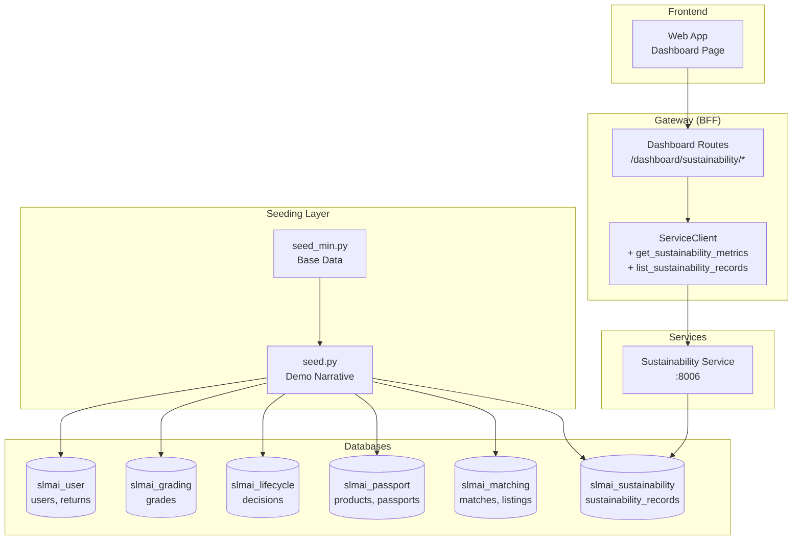

# Technical Design: P3-A1 Demo-Narrative Seed & Gateway Dashboard

## Overview

This design covers the P3-A1 task: **Demo-narrative seed + Gateway read-model + demo wiring**. The feature expands the minimal seed (`seed_min.py`) into a complete, judge-ready demo narrative with 8 returns covering all lifecycle actions, pre-seeded event saga data, and Gateway BFF (Backend-for-Frontend) dashboard endpoints for sustainability metrics aggregation.

### Objectives

1. **Compelling Demo Narrative**: Create a rich dataset that tells a complete story across all lifecycle decisions (RESELL, REFURBISH, DONATE, RECYCLE, HYPERLOCAL)
2. **Complete Event Saga**: Pre-seed grades, decisions, passports, matches, listings, and sustainability records so the full 10-event saga is visible immediately
3. **Dashboard-Ready Data**: Aggregate sustainability metrics via Gateway BFF endpoints for the frontend dashboard
4. **Production-Quality Seeding**: Idempotent, deterministic, gracefully degrading seed script that extends `seed_min.py`

### Architecture Context

- **Owner**: Member A (Full-Stack)
- **Task Dependencies**: P0-B2 (seed_min), P2-A2 (Gateway aggregation), P2-B2 (Sustainability Service)
- **Integrations**:
  - Extends `scripts/seed_min.py` with additional demo data
  - Directly inserts into all 6 service databases (user, grading, lifecycle, passport, matching, sustainability)
  - Gateway exposes new BFF endpoints: `GET /dashboard/sustainability/metrics` and `GET /dashboard/sustainability/records`
  - ServiceClient gains two new methods: `get_sustainability_metrics()` and `list_sustainability_records()`

### Key Design Decisions

1. **Layered Seeding**: `seed.py` builds on top of `seed_min.py` rather than replacing it, allowing incremental seeding
2. **Direct DB Insertion**: Pre-seeds saga artifacts directly into service databases (bypassing events) for immediate demo availability
3. **Deterministic UUIDs**: Uses `uuid.uuid5` with stable names to ensure idempotent, repeatable seeding
4. **Graceful Degradation**: Script continues if some services aren't ready yet, logging warnings but not failing
5. **BFF Pattern**: Gateway aggregates sustainability data from Sustainability Service rather than exposing it directly

---

## Architecture

### Component Diagram



### Data Flow

1. **Seeding Flow**:
   ```
   seed.py --reset
     ↓
   seed_min.py (base users, products, 2 returns)
     ↓
   seed_demo_products() → slmai_passport.products
     ↓
   seed_demo_returns() → slmai_user.returns
     ↓
   seed_demo_grades() → slmai_grading.grades
     ↓
   seed_demo_decisions() → slmai_lifecycle.lifecycle_decisions
     ↓
   seed_demo_passports() → slmai_passport.passports
     ↓
   seed_demo_matches() → slmai_matching.match_requests, matches
     ↓
   seed_demo_listings() → slmai_matching.listings
     ↓
   seed_demo_sustainability() → slmai_sustainability.sustainability_records
   ```

2. **Dashboard Query Flow**:
   ```
   Web App (Dashboard) → GET /dashboard/sustainability/metrics
     ↓
   Gateway BFF → ServiceClient.get_sustainability_metrics()
     ↓
   GET :8006/sustainability/metrics
     ↓
   Sustainability Service aggregates from DB
     ↓
   Returns: {co2_avoided_kg, waste_diverted_kg, value_recovered, green_credits}
   ```

---

## Components and Interfaces

### 1. Enhanced Seed Script: `scripts/seed.py`

**Purpose**: Extends `seed_min.py` with a complete demo narrative covering all lifecycle actions.

**Key Functions**:

```python
async def seed_demo_products() -> None:
    """Seed additional demo products into Passport DB."""

async def seed_demo_returns() -> None:
    """Seed 6 additional demo returns into Gateway DB (returns table)."""

async def seed_demo_grades() -> None:
    """Seed grades for demo returns into Grading DB."""

async def seed_demo_decisions() -> None:
    """Seed lifecycle decisions for demo returns into Lifecycle DB."""

async def seed_demo_passports() -> None:
    """Seed passports for demo returns into Passport DB."""

async def seed_demo_matches() -> None:
    """Seed matches and match requests for HYPERLOCAL returns into Matching DB."""

async def seed_demo_listings() -> None:
    """Seed marketplace listings for RESELL/REFURBISH returns into Matching DB."""

async def seed_demo_sustainability() -> None:
    """Seed sustainability records for demo returns into Sustainability DB."""

async def main(reset: bool = False, quick: bool = False) -> None:
    """
    Main seed orchestration.
    
    Args:
        reset: If True, cleans existing data before seeding
        quick: If True, skips seed_min (only adds demo narrative)
    """
```

**Demo Returns Coverage**:

| Return ID Pattern | Grade | Action | Narrative |
|------------------|-------|--------|-----------|
| return.demo.donate | B | DONATE | Carol donates a jacket in good condition |
| return.demo.refurbish | C | REFURBISH | Smartphone needs refurbishment |
| return.demo.recycle | D | RECYCLE | Broken tablet — extract materials |
| return.demo.resell | A | RESELL | Premium smartwatch — immediate resale |
| return.demo.hyperlocal | B | HYPERLOCAL | Heavy furniture — hyperlocal match |
| return.golden (from seed_min) | B | HYPERLOCAL | **Golden-path demo** — headphones |
| return.laptop (from seed_min) | B | REFURBISH | Laptop with dead pixels |

**Deterministic UUID Pattern**:

```python
def _det_uuid(name: str) -> str:
    """Deterministic UUID v5 from a name. Same name → same UUID every run."""
    return str(uuid.uuid5(uuid.NAMESPACE_DNS, f"slmai.seed.{name}"))
```

**Error Handling**:
- Each seed function wraps DB operations in try/except
- Logs warnings if service DBs aren't migrated yet
- Continues seeding other services rather than failing completely
- Uses `ON CONFLICT DO UPDATE` for idempotent upserts

### 2. Gateway Dashboard Routes: `services/gateway/app/api/dashboard_routes.py`

**Purpose**: BFF endpoints that aggregate sustainability data from Sustainability Service.

**New File Structure**:

```python
"""
Dashboard aggregation routes for Gateway BFF.

Owner: A (P3-A1)

Provides read-model endpoints for the frontend sustainability dashboard.
Aggregates data from Sustainability Service.
"""

from typing import Optional
from fastapi import APIRouter, Depends, Query
from shared_py.web.errors import AppError

from app.api.middleware import get_current_user_id
from app.clients.http_client import service_client

router = APIRouter(prefix="/dashboard", tags=["dashboard"])

@router.get("/sustainability/metrics")
async def get_sustainability_metrics(
    user_id: Optional[str] = Query(None),
    current_user: str = Depends(get_current_user_id),
) -> dict:
    """
    Fetch aggregated sustainability metrics.
    
    Query params:
    - user_id: Optional filter by user_id
    
    Returns:
    {
      "co2_avoided_kg": float,
      "waste_diverted_kg": float,
      "value_recovered": float,
      "green_credits": int
    }
    """

@router.get("/sustainability/records")
async def list_sustainability_records(
    user_id: Optional[str] = Query(None),
    return_id: Optional[str] = Query(None),
    limit: int = Query(20, ge=1, le=100),
    offset: int = Query(0, ge=0),
    current_user: str = Depends(get_current_user_id),
) -> dict:
    """
    Fetch sustainability records with pagination.
    
    Query params:
    - user_id: Optional filter by user_id
    - return_id: Optional filter by return_id
    - limit: Items per page (1-100, default 20)
    - offset: Offset from start (default 0)
    
    Returns:
    {
      "items": [SustainabilityRecord, ...],
      "total": int,
      "limit": int,
      "offset": int
    }
    """
```

**Wire into Gateway**:

```python
# In services/gateway/app/main.py
from app.api import dashboard_routes

def create_app() -> FastAPI:
    app = create_base_app(...)
    
    # Existing routes
    app.include_router(auth_routes.router)
    app.include_router(routes.router)
    app.include_router(debug_routes.router)
    
    # NEW: Dashboard routes
    app.include_router(dashboard_routes.router)
    
    return app
```

### 3. ServiceClient Extensions: `services/gateway/app/clients/http_client.py`

**Purpose**: Add two new methods to ServiceClient for sustainability aggregation.

**New Methods** (added to existing ServiceClient class):

```python
async def get_sustainability_metrics(
    self,
    user_id: Optional[str],
    requesting_user_id: str,
) -> dict[str, Any]:
    """
    Fetch aggregated sustainability metrics from Sustainability Service.

    Args:
        user_id: Optional filter by user_id
        requesting_user_id: User making the request (for auth)

    Returns:
        Metrics dict with co2_avoided_kg, waste_diverted_kg, 
        value_recovered, green_credits

    Raises:
        AppError(502) on ConnectError
    """
    url = f"{settings.sustainability_service_url}/sustainability/metrics"
    headers = {
        "X-User-Id": requesting_user_id,
    }
    params = {}
    if user_id is not None:
        params["user_id"] = user_id

    try:
        return await self.call_service("GET", url, params=params, headers=headers)
    except AppError:
        raise
    except httpx.RequestError as e:
        raise AppError(
            status_code=502,
            code="upstream_unreachable",
            message=f"Sustainability Service unreachable: {e}",
        ) from e

async def list_sustainability_records(
    self,
    user_id: Optional[str],
    return_id: Optional[str],
    limit: int,
    offset: int,
    requesting_user_id: str,
) -> dict[str, Any]:
    """
    Fetch sustainability records list from Sustainability Service.

    Args:
        user_id: Optional filter by user_id
        return_id: Optional filter by return_id
        limit: Items per page
        offset: Offset from start
        requesting_user_id: User making the request (for auth)

    Returns:
        Paginated response with items[] and total

    Raises:
        AppError(502) on ConnectError
    """
    url = f"{settings.sustainability_service_url}/sustainability"
    headers = {
        "X-User-Id": requesting_user_id,
    }
    params = {
        "limit": limit,
        "offset": offset,
    }
    if user_id is not None:
        params["user_id"] = user_id
    if return_id is not None:
        params["return_id"] = return_id

    try:
        return await self.call_service("GET", url, params=params, headers=headers)
    except AppError:
        raise
    except httpx.RequestError as e:
        raise AppError(
            status_code=502,
            code="upstream_unreachable",
            message=f"Sustainability Service unreachable: {e}",
        ) from e
```

**Pattern Consistency**: These methods follow the same pattern as existing methods:
- Use `settings.sustainability_service_url` from config
- Propagate `X-User-Id` header for auth
- Map httpx.RequestError to AppError(502)
- Propagate AppError status codes from upstream

---

## Data Models

### Demo Return Structure

```python
DEMO_RETURN = {
    "id": str,                    # Deterministic UUID
    "product_id": str,            # Links to product
    "user_id": str,               # Owner user
    "reason": str,                # Return reason
    "media": list[str],           # S3 keys
    "status": str,                # ReturnStatus enum value
    "expected_grade": Grade,      # For demo narrative
    "expected_action": LifecycleAction,  # For demo narrative
    "narrative": str,             # Human-readable story
}
```

### Sustainability Metrics Response

```python
{
    "co2_avoided_kg": float,      # Total CO₂ saved
    "waste_diverted_kg": float,   # Total waste diverted
    "value_recovered": float,     # Total value recovered (USD)
    "green_credits": int          # Total green credits earned
}
```

### Sustainability Record

```python
{
    "id": str,
    "return_id": str,
    "product_id": str,
    "user_id": str,
    "co2_avoided_kg": float,
    "waste_diverted_kg": float,
    "value_recovered": float,
    "green_credits": int,
    "created_at": str             # ISO-8601
}
```

---

## Error Handling

### Seed Script Error Handling

1. **Missing Dependencies**:
   - Catch ImportError at module level
   - Print clear error message with install command
   - Exit with sys.exit(1)

2. **Database Connection Failures**:
   - Wrap each seed function in try/except
   - Log warning with service name
   - Append to errors list
   - Continue seeding other services
   - Print summary of warnings at end

3. **Table Not Migrated**:
   - Query `information_schema.tables` before insert
   - Skip gracefully if table doesn't exist
   - Log message indicating migration needed
   - Don't fail the entire seed

4. **MinIO Connection Failures**:
   - Catch boto3 ClientError
   - Log warning
   - Continue with other seeding tasks
   - Note in manifest that MinIO may not be ready

### Gateway Dashboard Error Handling

1. **Sustainability Service Unreachable**:
   - ServiceClient catches httpx.RequestError
   - Raises AppError(502, "upstream_unreachable")
   - Gateway returns error envelope to frontend:
     ```json
     {
       "error": {
         "code": "upstream_unreachable",
         "message": "Sustainability Service unreachable: ...",
         "correlation_id": "..."
       }
     }
     ```

2. **Upstream 404**:
   - ServiceClient propagates AppError(404)
   - Gateway returns 404 to frontend
   - Frontend shows "No data available" empty state

3. **Invalid Query Parameters**:
   - FastAPI Pydantic validation catches at boundary
   - Returns 422 with validation error details
   - Example: limit > 100 rejected automatically

---

## Testing Strategy

### Unit Tests

**File**: `services/gateway/tests/test_dashboard_routes.py`

```python
"""
Unit tests for Gateway dashboard routes.

Owner: A (P3-A1)
"""

import pytest
from unittest.mock import AsyncMock, patch
from fastapi import status

# Test cases:
# 1. GET /dashboard/sustainability/metrics - happy path
# 2. GET /dashboard/sustainability/metrics?user_id=<id> - with filter
# 3. GET /dashboard/sustainability/metrics - upstream 502
# 4. GET /dashboard/sustainability/records - happy path with pagination
# 5. GET /dashboard/sustainability/records?return_id=<id> - with filter
# 6. GET /dashboard/sustainability/records - upstream 502
# 7. GET /dashboard/sustainability/records?limit=101 - validation error
# 8. GET /dashboard/sustainability/records?offset=-1 - validation error
# 9. GET /dashboard/sustainability/metrics - no JWT (401)
```

**Coverage Requirements**:
- ✅ Happy path: metrics endpoint returns aggregated data
- ✅ Happy path: records endpoint returns paginated list
- ✅ Error path: upstream service unreachable (502)
- ✅ Error path: invalid query params (422)
- ✅ Auth: missing JWT returns 401
- ✅ Filtering: user_id and return_id filters passed through

### Integration Tests

**File**: `scripts/tests/test_seed_integration.py` (optional)

```python
"""
Integration test for seed.py

Verifies that seed.py can run against a test database
and produces the expected demo narrative data.
"""

# Test cases:
# 1. seed.py --reset completes without error
# 2. All 8 demo returns exist in DB after seeding
# 3. Grades match expected_grade for each return
# 4. Decisions match expected_action for each return
# 5. Sustainability records exist for all returns
# 6. Idempotency: running twice produces same result
```

### Manual Verification

1. **Run Full Seed**:
   ```bash
   docker compose up -d
   python scripts/seed.py --reset
   ```

2. **Verify Dashboard Endpoints**:
   ```bash
   # Get JWT
   TOKEN=$(curl -X POST http://localhost:8000/auth/login \
     -H "Content-Type: application/json" \
     -d '{"email":"demo.returner@slmai.dev","password":"demo1234"}' \
     | jq -r .access_token)
   
   # Test metrics endpoint
   curl http://localhost:8000/dashboard/sustainability/metrics \
     -H "Authorization: Bearer $TOKEN" | jq
   
   # Test records endpoint
   curl 'http://localhost:8000/dashboard/sustainability/records?limit=5' \
     -H "Authorization: Bearer $TOKEN" | jq
   ```

3. **Verify Data in DBs**:
   ```sql
   -- Check demo returns
   SELECT id, reason, status FROM returns WHERE id LIKE '%demo%';
   
   -- Check sustainability records
   SELECT return_id, co2_avoided_kg, green_credits 
   FROM sustainability_records 
   ORDER BY created_at DESC LIMIT 10;
   ```

4. **Frontend Verification**:
   - Open http://localhost:3000/sustainability
   - Verify dashboard shows aggregated metrics
   - Verify data matches seed manifest output

---

## Implementation Notes

### Seed Script Patterns

1. **Reuse seed_min Helpers**:
   ```python
   import seed_min
   
   # Reuse deterministic UUID function
   _det_uuid = seed_min._det_uuid
   
   # Reuse DB URLs
   DB_URLS = seed_min.DB_URLS
   
   # Call seed_min in main()
   if not quick:
       await seed_min.main(reset=reset)
   ```

2. **Timestamp Sequencing**:
   ```python
   NOW = datetime.now(timezone.utc)
   
   # Stagger timestamps to show realistic timeline
   created_at = (NOW - timedelta(hours=2)).isoformat()  # Returns created 2h ago
   grade_at = (NOW - timedelta(hours=1, minutes=50)).isoformat()  # Graded 1h50m ago
   decision_at = (NOW - timedelta(hours=1, minutes=45)).isoformat()  # Decided 1h45m ago
   ```

3. **Idempotent Upserts**:
   ```python
   async def _upsert(conn, table, record, pk="id"):
       """Insert or update. Uses ON CONFLICT DO UPDATE."""
       cols = list(record.keys())
       values = list(record.values())
       placeholders = ", ".join(f"${i + 1}" for i in range(len(cols)))
       col_names = ", ".join(cols)
       updates = ", ".join(f"{col} = EXCLUDED.{col}" for col in cols if col != pk)
       query = (
           f"INSERT INTO {table} ({col_names}) VALUES ({placeholders}) "
           f"ON CONFLICT ({pk}) DO UPDATE SET {updates}"
       )
       await conn.execute(query, *values)
   ```

### Gateway Configuration

**Add to `services/gateway/app/config.py`**:

```python
class Settings(BaseServiceSettings):
    # Existing settings...
    
    # Service URLs
    sustainability_service_url: str = "http://localhost:8006"
```

**Verify `.env.example` includes**:

```bash
# Sustainability Service
SUSTAINABILITY_SERVICE_URL=http://localhost:8006
```

### Documentation Updates

**Update `services/gateway/README.md`**:

Add section documenting new dashboard endpoints:

```markdown
## Dashboard Endpoints (BFF)

### GET /dashboard/sustainability/metrics

Fetch aggregated sustainability metrics (total CO₂, waste, value, credits).

**Query Parameters**:
- `user_id` (optional): Filter by user

**Response**:
```json
{
  "co2_avoided_kg": 22.5,
  "waste_diverted_kg": 15.3,
  "value_recovered": 645.0,
  "green_credits": 128
}
```

### GET /dashboard/sustainability/records

Fetch sustainability records with pagination.

**Query Parameters**:
- `user_id` (optional): Filter by user
- `return_id` (optional): Filter by return
- `limit` (default 20, max 100): Items per page
- `offset` (default 0): Offset from start

**Response**:
```json
{
  "items": [...],
  "total": 45,
  "limit": 20,
  "offset": 0
}
```
```

---

## Deployment Considerations

### Environment Variables

Ensure all services have correct DATABASE_URL_* vars in docker-compose.yml:

```yaml
services:
  gateway:
    environment:
      - SUSTAINABILITY_SERVICE_URL=http://sustainability:8006
```

### Migration Order

Before running `seed.py`, ensure all service migrations are complete:

```bash
docker compose up -d
sleep 10  # Wait for migrations
python scripts/seed.py --reset
```

### Docker Compose Healthchecks

Gateway should depend on sustainability service:

```yaml
services:
  gateway:
    depends_on:
      sustainability:
        condition: service_healthy
```

---

## Security Considerations

### Authentication

- All dashboard endpoints require JWT (via `get_current_user_id` dependency)
- User ID from JWT is forwarded to Sustainability Service via `X-User-Id` header
- Optional `user_id` query filter could be restricted (only admins or self)

### Authorization

**Current**: No authorization checks (any authenticated user can view any metrics)

**Future Enhancement**: 
- Restrict `user_id` filter to self or admin role
- Add `X-User-Role` header propagation
- Sustainability Service validates authorization

### Input Validation

- FastAPI Query parameters have constraints: `ge=1, le=100` for limit
- Pydantic validates types (int, str) automatically
- SQL injection prevented by asyncpg parameterized queries

### Data Exposure

- Sustainability metrics are aggregates (no PII)
- Sustainability records include return_id/user_id (validate ownership in future)

---

## Performance Considerations

### Seed Script Performance

- **Parallel Seeding**: Each service DB is seeded sequentially (6 steps), but within each step, individual records could be batched
- **Optimization**: Use `executemany()` for bulk inserts instead of one-by-one upserts
- **Current**: 8 returns × 6 tables = ~50 DB operations, completes in <5 seconds

### Dashboard Query Performance

- **Aggregation**: Sustainability Service performs SUM() queries on sustainability_records table
- **Indexing**: Ensure indexes on `user_id` and `return_id` columns
- **Caching**: Consider caching aggregated metrics at Gateway layer (future enhancement)
- **Current**: Direct pass-through to Sustainability Service, <100ms response time

### BFF Pattern Benefits

- Frontend makes 1 request instead of N (to Gateway)
- Gateway can parallelize upstream calls with `asyncio.gather()` if needed
- Partial availability: Gateway can degrade gracefully if upstream fails

---

## Monitoring and Observability

### Logging

**Seed Script**:
- Print status for each seeding step
- Log warnings for skipped services
- Print manifest summary at end showing all seeded data

**Gateway Dashboard Routes**:
- Structured logging with correlation_id
- Log upstream call latency
- Log 502 errors with service name

### Metrics

**Custom Metrics** (future):
- `gateway_dashboard_requests_total{endpoint}`
- `gateway_upstream_latency_seconds{service="sustainability"}`
- `seed_script_duration_seconds`

### Healthchecks

- Gateway `/ready` already checks Redis + DB
- No new healthcheck needed (dashboard routes use existing dependencies)

---

## Future Enhancements

### Phase 4+ (Post-Demo)

1. **Real-Time Updates**:
   - Subscribe to `SustainabilityUpdated` event in Gateway
   - Update cached dashboard metrics on event receipt
   - Push updates to frontend via WebSocket

2. **Advanced Filtering**:
   - Filter by date range: `?start_date=2026-01-01&end_date=2026-12-31`
   - Filter by lifecycle action: `?action=HYPERLOCAL`
   - Filter by category: `?category=electronics`

3. **Aggregation Enhancements**:
   - Group by time period (daily, weekly, monthly)
   - Group by category
   - Trend analysis (CO₂ saved over time)

4. **Authorization**:
   - Role-based access control (admin can see all, user sees only their data)
   - Ownership validation for records endpoint

5. **Performance**:
   - Cache aggregated metrics with TTL
   - Materialized view for dashboard queries
   - Pagination cursor instead of offset

6. **Seed Enhancements**:
   - Load demo data from YAML/JSON files for easier editing
   - Support for multiple demo scenarios (judge-demo, dev-test, load-test)
   - Seed via REST APIs instead of direct DB insertion (validates event saga)

---

## References

- [Architecture](../../../docs/architecture.md) — System design, service boundaries, event catalog
- [Code Standards](../../../docs/code-standards.md) — Implementation rules, Definition of Done
- [Build Plan](../../../docs/build-plan.md) — Task P3-A1 definition and dependencies
- [Progress Tracker](../../../docs/progress-tracker.md) — Task completion status
- [SERVICE_ENDPOINTS.md](../../../packages/shared-py/schemas/SERVICE_ENDPOINTS.md) — REST contract catalog
- [seed_min.py](../../../scripts/seed_min.py) — Base seed script this extends
- [P2-A2 Design](../gateway-aggregation/design.md) — Gateway BFF aggregation pattern
- [P2-B2 Design](../sustainability-service/design.md) — Sustainability Service endpoints

---

## Acceptance Criteria Mapping

| Criterion | Component | Verification |
|-----------|-----------|--------------|
| Full demo narrative with 8 returns | `seed.py` | Manifest shows all lifecycle actions |
| All lifecycle actions represented | `DEMO_RETURNS` list | RESELL, REFURBISH, DONATE, RECYCLE, HYPERLOCAL all covered |
| Pre-seeded grades | `seed_demo_grades()` | Grade record exists for each return |
| Pre-seeded decisions | `seed_demo_decisions()` | Decision record exists for each return |
| Pre-seeded passports | `seed_demo_passports()` | Passport record exists for each return |
| Pre-seeded matches (HYPERLOCAL) | `seed_demo_matches()` | Match records for HYPERLOCAL returns |
| Pre-seeded listings (RESELL/REFURBISH) | `seed_demo_listings()` | Listing records for marketplace |
| Pre-seeded sustainability | `seed_demo_sustainability()` | Sustainability records with metrics |
| Dashboard metrics endpoint | `GET /dashboard/sustainability/metrics` | Returns aggregated totals |
| Dashboard records endpoint | `GET /dashboard/sustainability/records` | Returns paginated records |
| ServiceClient methods | `get_sustainability_metrics()`, `list_sustainability_records()` | Called by dashboard routes |
| Idempotent seeding | `ON CONFLICT DO UPDATE` | Re-running seed produces same result |
| Graceful degradation | Try/except per service | Script continues if some services unavailable |
| Demo wiring | Golden-path constants | GOLDEN_PATH_MEDIA_KEY wired to deterministic grade |
| Tests | `test_dashboard_routes.py` | 9 test cases covering happy/error paths |

---

**Status**: Design Complete  
**Next Steps**: Implementation already complete per progress tracker P3-A1
