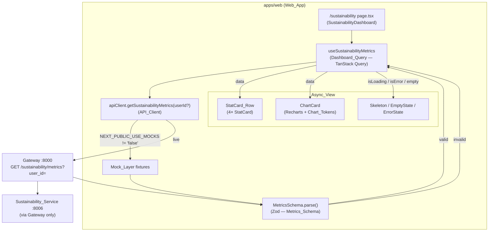
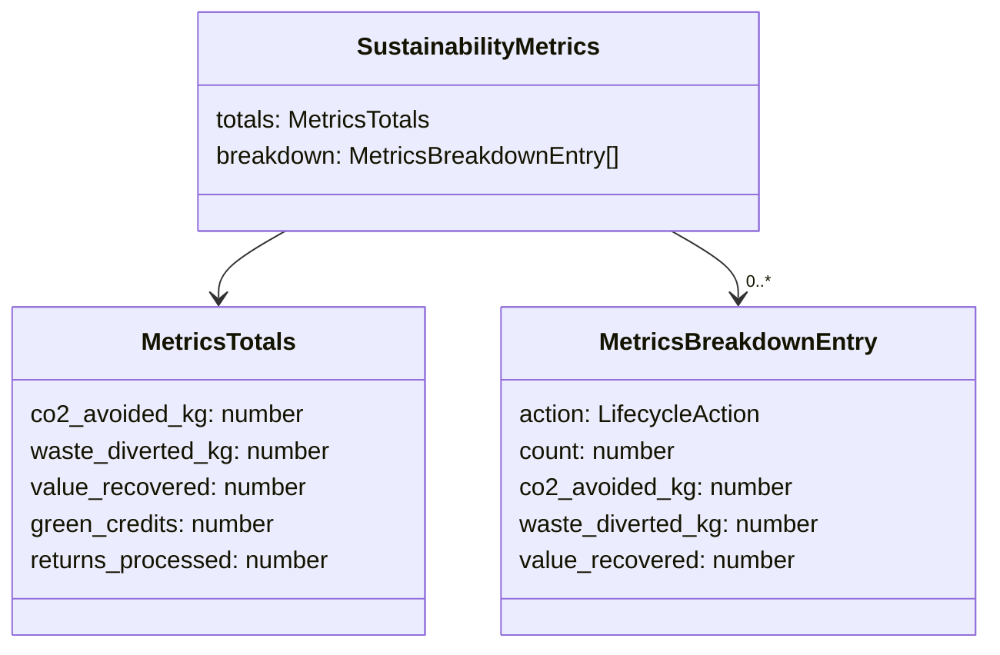

# Design Document — Sustainability Dashboard (P3-C1)

## Overview

The Sustainability Dashboard is the closing beat of the demo narrative: a dedicated
`/sustainability` page that visualizes the cumulative environmental and economic impact of
processed returns — CO₂ avoided, waste diverted, value recovered, and green credits — plus a
per-lifecycle-action breakdown chart.

This design is scoped to `apps/web` only (Member C / Frontend) and is built on the established
stack: **Next.js 14 App Router**, **TypeScript**, **Tailwind**, **TanStack Query**, **Zod**, and
**Recharts**. It strictly honors the repo's architectural boundaries and design system:

- **Gateway-only data access.** The page consumes data exclusively through the typed `API_Client`
  (`apps/web/src/lib/api-client.ts`), which calls the Gateway endpoint
  `GET /sustainability/metrics?user_id=`. The Web_App never calls a backend service directly.
- **Validated at the boundary.** Every metrics payload (live or mock) is parsed through a Zod
  `Metrics_Schema` before it reaches the UI, so malformed data fails safely as a query error.
- **Mock-first.** Until the live Gateway aggregate is wired, the `Mock_Layer` returns static
  fixtures that conform to `Metrics_Schema` (driven by `NEXT_PUBLIC_USE_MOCKS`).
- **Reuse before invent.** The dashboard reuses the registry's `StatCard` (P2-C1), `Skeleton`,
  `EmptyState`, `ErrorState`, and `PageHeader`, and introduces exactly one new feature component,
  `ChartCard`, which is registered on completion.
- **Tokens only.** All colors, spacing, radius, and typography come from `docs/ui-tokens.md`. Chart
  series colors come from the `chart-1 … chart-6` `Chart_Tokens` (§2.6), which are **not yet
  present** in the token configuration and must be added before use (Requirement 7.4).

### Design Research Summary

Grounding the design in the current codebase surfaced the following facts that shape it:

| Finding | Source | Impact on design |
|---------|--------|------------------|
| `chart-1 … chart-6` are defined in `ui-tokens.md §2.6` but **absent** from `globals.css` and `tailwind.config.ts`. | `apps/web/src/app/globals.css`, `apps/web/tailwind.config.ts` | Requirement 7.4 is live: the design adds `--chart-1 … --chart-6` CSS variables and Tailwind `chart` color mappings as a prerequisite step. |
| `api-client.ts` has **no Zod usage** and exposes `getDashboardMetrics()` (→ `/sustainability/dashboard`), not a metrics method. | `apps/web/src/lib/api-client.ts` | Add a new `getSustainabilityMetrics(userId?)` method targeting `/sustainability/metrics`, with Zod validation, without disturbing existing methods. |
| Existing pages (e.g. `matches/page.tsx`) use manual `useEffect`/`useState`, although `Providers` already mounts a `QueryClientProvider`. | `apps/web/src/app/matches/page.tsx`, `apps/web/src/components/providers.tsx` | Introduce a proper `Dashboard_Query` TanStack Query hook (the requirements call for it); the QueryClient is already available app-wide. |
| `SustainabilityMetricsResponse` (totals + breakdown) already exists as a TS interface. | `apps/web/types/api.ts` | The Zod schema mirrors this exact shape; the schema becomes the runtime source of truth and its inferred type is reconciled with the existing interface. |
| `StatCard` props are `{ label, value, unit?, delta?, icon?, tone? }`; `formatNumber` exists in `lib/utils.ts`. | `apps/web/src/components/features/StatCard.tsx`, `apps/web/src/lib/utils.ts` | `StatCard_Row` maps the four headline metrics onto these props and formats values with `formatNumber`. |
| `ChartCard` is registry status `📋 Planned` with a defined prop sketch (`title, description?, children, isLoading?, isError?`). | `docs/ui-registry.md` | Implement `ChartCard` to that contract, add `EmptyState` support, and flip the registry entry to `✅ Built`. |

## Architecture

The dashboard is a thin, client-rendered slice that layers cleanly onto the existing frontend
architecture. Data flows in one direction: Gateway → API_Client (+ Zod) → Dashboard_Query →
page → presentation components.



### Layering and responsibilities

| Layer | Module | Responsibility |
|-------|--------|----------------|
| Route / page | `apps/web/src/app/sustainability/page.tsx` | Compose the page: `PageHeader`, `StatCard_Row`, `ChartCard`; own the async-state branching (loading/error/empty/success). Client component (`"use client"`). |
| Data hook | `apps/web/src/hooks/use-sustainability-metrics.ts` | `Dashboard_Query`: wrap the API_Client call in `useQuery`, expose `data/isLoading/isError/refetch`. |
| Transport | `apps/web/src/lib/api-client.ts` | New `getSustainabilityMetrics(userId?)` method; chooses Mock_Layer vs live Gateway; runs `Metrics_Schema` validation in both paths. |
| Validation | `apps/web/src/lib/schemas/sustainability.ts` | `Metrics_Schema` (Zod) + inferred `SustainabilityMetrics` type. |
| Presentation (reused) | `StatCard`, `Skeleton`, `EmptyState`, `ErrorState`, `PageHeader` | Render headline metrics and async states. |
| Presentation (new) | `apps/web/src/components/features/ChartCard.tsx` | `ChartCard`: titled card wrapping a Recharts chart with its own loading/empty/error/success handling. |
| Tokens | `globals.css`, `tailwind.config.ts` | Add `--chart-1 … --chart-6` and `chart` color mappings (Requirement 7.4 prerequisite). |

### Architectural boundary enforcement

- The page imports data **only** through `apiClient` (no `fetch` to service ports, no direct
  `:8006` access). This satisfies Requirements 4.1 and 4.3.
- The API_Client targets the Gateway base URL (`NEXT_PUBLIC_API_BASE_URL`, default
  `http://localhost:8000`) and path `/sustainability/metrics` (Requirement 4.2).
- Validation runs inside the API_Client so both mock and live data are guaranteed to be schema-
  conformant before the hook resolves (Requirements 4.4–4.7).

## Components and Interfaces

### 1. Sustainability page (`app/sustainability/page.tsx`)

A client component that orchestrates the async view. It owns the loading/error/empty/success
branching and delegates all rendering to registry components.

```tsx
"use client"

import { PageHeader } from "@/components/features/PageHeader"
import { StatCardRow } from "@/components/features/StatCardRow" // co-located row (StatCard reused inside)
import { ChartCard } from "@/components/features/ChartCard"
import { ErrorState } from "@/components/features/ErrorState"
import { Skeleton } from "@/components/ui/Skeleton"
import { useSustainabilityMetrics } from "@/hooks/use-sustainability-metrics"

export default function SustainabilityPage() {
  const { data, isLoading, isError, error, refetch } = useSustainabilityMetrics()

  return (
    <div className="container mx-auto py-8 max-w-screen-xl px-4 md:px-6">
      <PageHeader
        title="Sustainability Impact"
        subtitle="Cumulative environmental and economic outcomes from processed returns"
        className="mb-8"
      />

      {isLoading ? (
        <DashboardSkeleton />
      ) : isError ? (
        <ErrorState
          message={error?.message ?? "Failed to load sustainability metrics."}
          onRetry={() => refetch()}
        />
      ) : (
        <div className="space-y-8 animate-in fade-in-50 duration-500">
          <StatCardRow totals={data.totals} />
          <ChartCard
            title="Impact by lifecycle action"
            description="CO₂ avoided per lifecycle decision across all processed returns"
            breakdown={data.breakdown}
          />
        </div>
      )}
    </div>
  )
}
```

- The page renders within the existing AppShell layout (applied by `app/layout.tsx`), satisfying
  Requirement 1.3. It serves the `/sustainability` route via App Router file convention
  (Requirement 1.1) and always renders the `PageHeader` (Requirement 1.2).
- Loading shows `Skeleton` placeholders (Requirement 5.1); error shows `ErrorState` with a retry
  that calls `refetch()` (Requirements 5.2, 5.3); success renders `StatCardRow` + `ChartCard`
  (Requirement 5.5). The empty-breakdown case is handled **inside** `ChartCard` (Requirement 5.4).

### 2. Dashboard_Query hook (`hooks/use-sustainability-metrics.ts`)

A typed TanStack Query hook. The QueryClient is already provided app-wide by `Providers`.

```ts
"use client"

import { useQuery } from "@tanstack/react-query"
import { apiClient } from "@/lib/api-client"
import type { SustainabilityMetrics } from "@/lib/schemas/sustainability"

export const SUSTAINABILITY_METRICS_KEY = ["sustainability", "metrics"] as const

export function useSustainabilityMetrics(userId?: string) {
  return useQuery<SustainabilityMetrics, Error>({
    queryKey: [...SUSTAINABILITY_METRICS_KEY, userId ?? null],
    queryFn: () => apiClient.getSustainabilityMetrics(userId),
    staleTime: 30_000,
    retry: 1,
  })
}
```

- `queryFn` delegates to the API_Client, which performs Zod validation. A `ZodError` thrown there
  propagates as a rejected query, so `isError` becomes `true` and the page renders `ErrorState`
  (Requirements 4.4, 4.5).
- `refetch` (returned by `useQuery`) is the retry control wired into `ErrorState` (Requirement 5.3).

### 3. API_Client method (`lib/api-client.ts`)

Add one method; do not disturb existing ones. It validates both mock and live payloads through
`Metrics_Schema`.

```ts
import { MetricsSchema, type SustainabilityMetrics } from "@/lib/schemas/sustainability"

// inside `apiClient`:
async getSustainabilityMetrics(userId?: string): Promise<SustainabilityMetrics> {
  if (USE_MOCKS) {
    // Mock_Layer — fixture is parsed so it is guaranteed schema-conformant (Req 4.6, 4.7)
    return MetricsSchema.parse(MOCKS.sustainabilityMetrics)
  }
  const query = userId ? `?user_id=${encodeURIComponent(userId)}` : ""
  const res = await fetch(`${API_BASE_URL}/sustainability/metrics${query}`)
  if (!res.ok) throw new Error("Failed to fetch sustainability metrics")
  const json = await res.json()
  return MetricsSchema.parse(json) // throws ZodError on malformed data (Req 4.5)
}
```

- `USE_MOCKS = process.env.NEXT_PUBLIC_USE_MOCKS !== "false"` (existing module constant) satisfies
  Requirement 4.6.
- Targets the Gateway base URL + `/sustainability/metrics?user_id=` (Requirements 4.1, 4.2).

### 4. Metrics_Schema (`lib/schemas/sustainability.ts`)

The Zod schema is the runtime contract. Its inferred type is the canonical
`SustainabilityMetrics` used across the slice and reconciled with the existing
`SustainabilityMetricsResponse` interface in `types/api.ts`.

```ts
import { z } from "zod"

// LifecycleAction values mirror types/enums.ts
export const LifecycleActionSchema = z.enum([
  "RESELL", "REFURBISH", "DONATE", "RECYCLE", "HYPERLOCAL",
])

export const BreakdownEntrySchema = z.object({
  action: LifecycleActionSchema,
  count: z.number().int().nonnegative(),
  co2_avoided_kg: z.number().nonnegative(),
  waste_diverted_kg: z.number().nonnegative(),
  value_recovered: z.number().nonnegative(),
})

export const MetricsTotalsSchema = z.object({
  co2_avoided_kg: z.number().nonnegative(),
  waste_diverted_kg: z.number().nonnegative(),
  value_recovered: z.number().nonnegative(),
  green_credits: z.number().nonnegative(),
  returns_processed: z.number().int().nonnegative(),
})

export const MetricsSchema = z.object({
  totals: MetricsTotalsSchema,
  breakdown: z.array(BreakdownEntrySchema),
})

export type SustainabilityMetrics = z.infer<typeof MetricsSchema>
export type MetricsBreakdownEntry = z.infer<typeof BreakdownEntrySchema>
```

- `MetricsSchema.parse` validates before render (Requirement 4.4) and throws on malformed input
  (Requirement 4.5). Because the schema mirrors the response exactly, parsing a valid object
  round-trips to an equivalent typed object (Requirement 4.7).

### 5. Mock_Layer fixture (`lib/api-client.ts`)

A static fixture with a non-empty `breakdown` so the demo shows a populated chart. It is parsed
through `Metrics_Schema` on return, guaranteeing conformance.

```ts
// MOCKS.sustainabilityMetrics
{
  totals: {
    co2_avoided_kg: 120.5,
    waste_diverted_kg: 45.2,
    value_recovered: 850.0,
    green_credits: 320,
    returns_processed: 12,
  },
  breakdown: [
    { action: "RESELL",    count: 5, co2_avoided_kg: 60.0, waste_diverted_kg: 20.0, value_recovered: 500.0 },
    { action: "REFURBISH", count: 3, co2_avoided_kg: 30.5, waste_diverted_kg: 12.2, value_recovered: 250.0 },
    { action: "DONATE",    count: 2, co2_avoided_kg: 18.0, waste_diverted_kg:  8.0, value_recovered:  60.0 },
    { action: "RECYCLE",   count: 1, co2_avoided_kg:  6.0, waste_diverted_kg:  3.0, value_recovered:  20.0 },
    { action: "HYPERLOCAL",count: 1, co2_avoided_kg:  6.0, waste_diverted_kg:  2.0, value_recovered:  20.0 },
  ],
}
```

### 6. StatCard_Row (`components/features/StatCardRow.tsx`)

A thin composition that maps the four `Headline_Metrics` onto the **existing** `StatCard`
component — it does not replace or reimplement the metric tile (Requirement 2.2).

```tsx
import { StatCard } from "@/components/features/StatCard"
import { formatNumber } from "@/lib/utils"
import { Leaf, Trash2, DollarSign, Award } from "lucide-react"
import type { SustainabilityMetrics } from "@/lib/schemas/sustainability"

export function StatCardRow({ totals }: { totals: SustainabilityMetrics["totals"] }) {
  return (
    <div className="grid grid-cols-1 sm:grid-cols-2 lg:grid-cols-4 gap-6">
      <StatCard label="CO₂ Avoided"    value={formatNumber(totals.co2_avoided_kg)}   unit="kg" icon={Leaf}       tone="success" />
      <StatCard label="Waste Diverted" value={formatNumber(totals.waste_diverted_kg)} unit="kg" icon={Trash2}    tone="success" />
      <StatCard label="Value Recovered" value={formatNumber(totals.value_recovered)}           icon={DollarSign} />
      <StatCard label="Green Credits"  value={formatNumber(totals.green_credits)}              icon={Award} />
    </div>
  )
}
```

- Renders exactly four tiles for CO₂ avoided, waste diverted, value recovered, green credits
  (Requirement 2.1), all sourced from the `totals` object (Requirement 2.3), with `unit="kg"` on the
  two mass metrics (Requirement 2.4), and all values formatted via `formatNumber` (Requirement 2.5).
- Spacing/typography come entirely from token-based Tailwind classes (Requirements 7.1, 7.2).

### 7. ChartCard (`components/features/ChartCard.tsx`) — new component

Implements the registry's planned contract, extended to accept `breakdown` data and own its empty
state. Marked `"use client"` (Recharts requires the browser).

```tsx
"use client"

import { Card, CardContent, CardHeader, CardTitle, CardDescription } from "@/components/ui/Card"
import { EmptyState } from "@/components/features/EmptyState"
import { ErrorState } from "@/components/features/ErrorState"
import { Skeleton } from "@/components/ui/Skeleton"
import { BarChart3 } from "lucide-react"
import { BarChart, Bar, XAxis, YAxis, Tooltip, ResponsiveContainer, Cell } from "recharts"
import { CHART_TOKENS } from "@/lib/chart-tokens"
import type { MetricsBreakdownEntry } from "@/lib/schemas/sustainability"

export interface ChartCardProps {
  title: string
  description?: string
  breakdown: MetricsBreakdownEntry[]
  isLoading?: boolean
  isError?: boolean
  onRetry?: () => void
}

export function ChartCard({ title, description, breakdown, isLoading, isError, onRetry }: ChartCardProps) {
  return (
    <Card>
      <CardHeader>
        <CardTitle>{title}</CardTitle>
        {description && <CardDescription>{description}</CardDescription>}
      </CardHeader>
      <CardContent>
        {isLoading ? (
          <Skeleton className="h-72 w-full rounded-lg" />
        ) : isError ? (
          <ErrorState message="Failed to load chart data." onRetry={onRetry} />
        ) : breakdown.length === 0 ? (
          <EmptyState icon={BarChart3} title="No impact data yet"
            description="Process a return to see lifecycle impact here." />
        ) : (
          <ResponsiveContainer width="100%" height={288}>
            <BarChart data={breakdown}>
              <XAxis dataKey="action" />
              <YAxis />
              <Tooltip />
              <Bar dataKey="co2_avoided_kg">
                {breakdown.map((entry, i) => (
                  <Cell key={entry.action} fill={CHART_TOKENS[i % CHART_TOKENS.length]} />
                ))}
              </Bar>
            </BarChart>
          </ResponsiveContainer>
        )}
      </CardContent>
    </Card>
  )
}
```

- Renders at least one Recharts chart (Requirement 3.1); series colors come from `CHART_TOKENS`
  (`chart-1 … chart-6`) only (Requirements 3.2, 7.3). One `Cell`/datum per breakdown entry
  (Requirement 3.3). Title always shown; description shown beneath it only when provided
  (Requirements 3.4, 3.5). Empty `breakdown` renders an `EmptyState` (Requirement 5.4).

### 8. Chart_Tokens (`lib/chart-tokens.ts` + token config)

`chart-1 … chart-6` are absent from the token config, so per Requirement 7.4 they are added before
use. Two coordinated edits plus a typed accessor:

`globals.css` (`:root`) — add CSS variables matching `ui-tokens.md §2.6`:

```css
--chart-1: 152 60% 36%;  /* #22A06B accent green  */
--chart-2: 207 90% 54%;  /* #1E88E5 info blue      */
--chart-3: 36 100% 50%;  /* #FF9900 primary gold   */
--chart-4: 258 90% 66%;  /* #8B5CF6 violet         */
--chart-5: 330 81% 60%;  /* #EC4899 pink           */
--chart-6: 173 80% 40%;  /* #14B8A6 teal           */
```

`tailwind.config.ts` (`extend.colors`) — map them:

```ts
chart: {
  1: "hsl(var(--chart-1))", 2: "hsl(var(--chart-2))", 3: "hsl(var(--chart-3))",
  4: "hsl(var(--chart-4))", 5: "hsl(var(--chart-5))", 6: "hsl(var(--chart-6))",
},
```

`lib/chart-tokens.ts` — ordered accessor consumed by Recharts (which needs concrete color strings,
resolved from the CSS variables, never raw hex literals in components):

```ts
export const CHART_TOKENS = [
  "hsl(var(--chart-1))", "hsl(var(--chart-2))", "hsl(var(--chart-3))",
  "hsl(var(--chart-4))", "hsl(var(--chart-5))", "hsl(var(--chart-6))",
] as const
```

### 9. Component_Registry update

On completion, flip `docs/ui-registry.md` `ChartCard` from `📋 Planned` to `✅ Built`, recording
path, final props (`title`, `description?`, `breakdown`, `isLoading?`, `isError?`, `onRetry?`),
tokens used (`Card`, `chart-1..6`), and dependencies (Card, recharts, Skeleton, EmptyState,
ErrorState) (Requirement 6.3). Update the registry status summary counts.

## Data Models

The Zod-inferred `SustainabilityMetrics` is the canonical client model. It mirrors the Gateway's
`SustainabilityMetricsResponse` contract (`packages/shared-py` REST contracts and
`apps/web/types/api.ts`).



| Field | Type | Notes |
|-------|------|-------|
| `totals.co2_avoided_kg` | number ≥ 0 | Headline metric, unit "kg". |
| `totals.waste_diverted_kg` | number ≥ 0 | Headline metric, unit "kg". |
| `totals.value_recovered` | number ≥ 0 | Headline metric, currency. |
| `totals.green_credits` | number ≥ 0 | Headline metric. |
| `totals.returns_processed` | integer ≥ 0 | Supporting total (not a headline tile). |
| `breakdown[].action` | `LifecycleAction` enum | RESELL / REFURBISH / DONATE / RECYCLE / HYPERLOCAL. |
| `breakdown[].count` | integer ≥ 0 | Returns in this action bucket. |
| `breakdown[].co2_avoided_kg` | number ≥ 0 | Charted series value. |
| `breakdown[].waste_diverted_kg` | number ≥ 0 | Available for alternate series. |
| `breakdown[].value_recovered` | number ≥ 0 | Available for alternate series. |

The inferred type supersedes the hand-written `SustainabilityMetricsResponse` interface as the
runtime-validated source of truth; the existing interface is kept type-compatible (the schema's
`z.infer` is assignable to it).

## Correctness Properties

*A property is a characteristic or behavior that should hold true across all valid executions of a
system — essentially, a formal statement about what the system should do. Properties serve as the
bridge between human-readable specifications and machine-verifiable correctness guarantees.*

These properties apply to this feature's pure logic layer — the Zod `Metrics_Schema` (validation
and round-trip) and the deterministic data→view mappings in `StatCard_Row` and `ChartCard`.
Routing, layout composition, async-state wiring, token-compliance, and registry updates are
validated by example/integration/smoke tests instead (see Testing Strategy).

The four properties below were consolidated from the prework analysis to remove redundancy
(criteria 2.3+2.5 combined; 4.4+4.7 combined; 3.3+5.4 combined).

### Property 1: Metrics schema round-trip

*For any* valid sustainability metrics object (including every Mock_Layer fixture), parsing it with
`Metrics_Schema` succeeds and produces a typed object deep-equal to the input.

**Validates: Requirements 4.4, 4.7**

### Property 2: Malformed metrics are rejected and surfaced as errors

*For any* metrics payload that violates `Metrics_Schema` (a missing required field, a wrong-typed
field, or a negative-where-non-negative value), `Metrics_Schema.parse` throws, and the resulting
`Dashboard_Query` surfaces an error result rather than rendering data.

**Validates: Requirements 4.5**

### Property 3: StatCard_Row reflects totals formatted with formatNumber

*For any* valid `totals` object, the `StatCard_Row` renders one tile per Headline_Metric (CO₂
avoided, waste diverted, value recovered, green credits) whose displayed value equals
`formatNumber` applied to the corresponding `totals` field.

**Validates: Requirements 2.3, 2.5**

### Property 4: ChartCard renders one datum per breakdown entry

*For any* `breakdown` array, the `ChartCard` renders exactly as many chart series data points as
there are entries in the array; when the array is empty it renders an `EmptyState` and no chart
data points.

**Validates: Requirements 3.3, 5.4**

## Error Handling

| Condition | Where handled | Behavior |
|-----------|---------------|----------|
| Live Gateway returns non-2xx | `API_Client.getSustainabilityMetrics` | Throw `Error("Failed to fetch sustainability metrics")`; query rejects → page shows `ErrorState`. |
| Response fails `Metrics_Schema` validation | `API_Client` (`MetricsSchema.parse`) | `ZodError` propagates → query `isError` → page shows `ErrorState` (Requirement 4.5). |
| Network failure / fetch rejects | TanStack Query | Query enters error state after `retry: 1`; page shows `ErrorState` with retry. |
| User activates retry | `ErrorState.onRetry` → `refetch()` | Re-runs `queryFn` → re-fetches and re-validates (Requirement 5.3). |
| Success but `breakdown` empty | `ChartCard` | Renders `EmptyState`; `StatCard_Row` still renders from `totals` (Requirement 5.4). |
| Mocks enabled with malformed fixture (dev error) | `API_Client` | `MetricsSchema.parse` throws on the fixture, failing fast in development rather than shipping bad mock data. |

Error messages are user-facing and free of internal/stack detail; no secrets or tokens are logged
(repo security rule). The `ErrorState` component supplies the retry affordance and accessible
messaging.

## Testing Strategy

A dual approach: property-based tests for the pure logic layer, and example/integration/smoke
tests for routing, state wiring, and token/registry constraints.

### Tooling

- **Test runner:** the workspace's configured runner (Jest or Vitest as set up in `apps/web`).
  Run single-pass (e.g. `vitest --run` / `jest`), never watch mode.
- **Component rendering:** React Testing Library.
- **Property-based testing:** **fast-check** (the standard PBT library for TypeScript). Do not hand-
  roll generators or a PBT engine.
- **Network:** mock `fetch` for API_Client tests; the Mock_Layer path needs no network.

### Property-based tests (fast-check)

- Each correctness property is implemented by **one** property-based test running a **minimum of
  100 iterations**.
- Each test is tagged with a comment referencing its design property, using the format:
  `// Feature: sustainability-dashboard, Property {n}: {property text}`.
- Generators:
  - A `validMetricsArbitrary` producing `{ totals, breakdown }` with non-negative numbers,
    non-negative-integer counts/`returns_processed`, and `action` drawn from the LifecycleAction
    enum (breakdown length 0..N to exercise the empty case).
  - An `invalidMetricsArbitrary` that takes a valid object and corrupts it (drops a required field,
    swaps a number for a string, or injects a negative value) for Property 2.

| Property | Test focus |
|----------|-----------|
| Property 1 | `MetricsSchema.parse(obj)` succeeds and deep-equals `obj` for generated valid objects and the mock fixture (round-trip). |
| Property 2 | `MetricsSchema.parse(bad)` throws for generated invalid payloads; hook/query reports error. |
| Property 3 | Render `StatCardRow` with generated `totals`; assert each tile shows `formatNumber(field)`. |
| Property 4 | Render `ChartCard` with generated `breakdown`; assert rendered datum count === `breakdown.length`, and `EmptyState` shown iff length 0. |

### Example / unit tests

- Route renders at `/sustainability` with `PageHeader` title + subtitle (Reqs 1.1, 1.2).
- `StatCardRow` renders exactly four tiles with correct labels; the two mass tiles carry `unit="kg"`
  (Reqs 2.1, 2.4); imports and reuses `StatCard` (Req 2.2).
- `ChartCard` shows title always, description only when provided (Reqs 3.4, 3.5); fills come from
  `CHART_TOKENS` (Reqs 3.2, 7.3).
- Async states: loading → `Skeleton` (5.1); error → `ErrorState` + retry (5.2); retry → `refetch`
  called (5.3); success → row + chart (5.5).
- Mocks enabled → `getSustainabilityMetrics` resolves to the fixture (Req 4.6).

### Integration tests

- With mocks disabled, `getSustainabilityMetrics(userId)` calls
  `GET {API_BASE_URL}/sustainability/metrics?user_id=...` (Reqs 4.1, 4.2) — 1–2 examples with mocked
  `fetch`.

### Smoke / static checks

- `--chart-1 … --chart-6` exist in `globals.css` and `tailwind.config.ts` `chart` mapping
  (Req 7.4).
- No raw hex/px in the new files; colors/spacing/typography use tokens (Reqs 7.1, 7.2) — ui-rules
  lint / grep.
- Page imports data only via `apiClient`; no backend service ports referenced (Reqs 4.3, 6.1).
- `docs/ui-registry.md` `ChartCard` entry flipped to `✅ Built` with path/props/tokens (Req 6.3).
