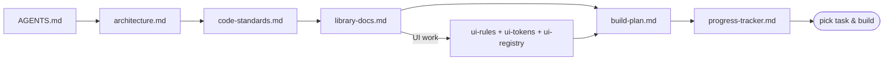

**# AGENTS.md — Amazon Second Life AI**

> ****Start here.**** This is the entry point for every AI agent and engineer working in this

> repo. It tells you which context files to read, in what order, and the rules to follow so

> three people building in parallel produce one coherent system. Read this fully before

> writing any code.

**---**

**## What we're building**

****Amazon Second Life AI**** — an event-driven microservices platform that decides the best, most

sustainable "second life" for every returned product (Resell / Refurbish / Donate / Recycle /

Hyperlocal match), with AI grading, a digital product passport, hyperlocal buyer matching, and

a sustainability dashboard.

- ****Stack:**** FastAPI microservices · PostgreSQL · Redis Streams · MinIO · AWS Bedrock +

  Rekognition (mockable) · Next.js + Tailwind frontend. Monorepo. Local Docker Compose;

  frontend on Vercel.

- ****Team:**** A (Full-Stack), B (AI & Backend), C (Frontend). See ownership below.

- ****Source of truth for the product:**** [prd.md](prd.md) and [project-overview.md](project-overview.md).

**---**

**## Read order (context protocol)**

Read these ****in order**** before acting. Don't skip — later files assume earlier ones.

1. ****AGENTS.md**** (this file) — rules, ownership, workflow.

2. ****[docs/architecture.md](**docs/architecture.md**)**** — services, data model, event saga, infra, repo layout.

3. ****[docs/code-standards.md](**docs/code-standards.md**)**** — implementation rules, naming, git workflow, Definition of Done.

4. ****[docs/library-docs.md](**docs/library-docs.md**)**** — per-library usage rules + pinned versions. Read the entry for any library you'll touch.

5. ****If doing frontend/UI work, also read:****

   - ****[docs/ui-rules.md](**docs/ui-rules.md**)**** — how to build UI.

   - ****[docs/ui-tokens.md](**docs/ui-tokens.md**)**** — the only allowed colors/spacing/type values.

   - ****[docs/ui-registry.md](**docs/ui-registry.md**)**** — existing components (reuse before inventing).

6. ****[docs/build-plan.md](**docs/build-plan.md**)**** — find your next task (by member + phase + dependencies).

7. ****[docs/progress-tracker.md](**docs/progress-tracker.md**)**** — confirm what's done / in progress; this is the live status SoT.



**---**

**## Ownership**

| Member | Role | Owns |

|--------|------|------|

| ****A**** | Full-Stack | `services/{gateway,user,passport}`, `packages/shared-py/{web,events,config,schemas}`, Docker Compose, DB, `scripts/` (seed + observability) |

| ****B**** | AI & Backend | `services/{grading,lifecycle,matching,sustainability}`, `packages/shared-py/ai` (Bedrock/Rekognition/mock), prompts, scoring |

| ****C**** | Frontend | `apps/web` (all UI), design system (tokens + registry), Vercel deploy |

****Service → owner:**** gateway·user·passport → ****A**** · grading·lifecycle·matching·sustainability → ****B**** · web → ****C****.

**---**

**## How to pick your next task**

1. Open [docs/progress-tracker.md](docs/progress-tracker.md).

2. Find the ****lowest-numbered `📋 Not started` task for your member**** whose dependencies (in

   [docs/build-plan.md](docs/build-plan.md)) are `✅ Done`.

3. Set it `🚧 In progress` (your initials + date).

4. Build it per the standards. If a dependency you need isn't done, build against the

   ****contract/mock**** and note it.

5. On completion, satisfy the Definition of Done, then set `✅ Done` with notes + link.

> ****Phase 0 first.**** Until checkpoint ****CP0**** is green, only Phase 0 tasks are eligible.

**---**

**## Operating Rules (always)**

1. ****Contract-first.**** Define/confirm the OpenAPI route shape and event payload before

   implementing. Contracts live in [docs/architecture.md](docs/architecture.md) §6 and

   [docs/code-standards.md](docs/code-standards.md) §4. Changing a contract = announce + update

   both stacks.

2. ****Services own their data.**** Never read another service's DB. Cross-service = REST (via

   Gateway) or events.

3. ****Events only via the shared wrapper**** (`packages/shared-py/events`); handlers are

   ****idempotent****; always propagate `correlation_id`.

4. ****AI only via the shared wrapper**** (`packages/shared-py/ai`); never `import boto3` in a

   service. Mock mode (`AI_MODE=mock`) must always work without AWS keys.

5. ****Frontend talks to the Gateway only.**** Never call individual services from the web app.

6. ****UI = tokens + registry.**** No raw hex/px; reuse registry components before inventing; every

   async view has loading/empty/error/success states.

7. ****Config via env.**** No hardcoded secrets/URLs/ports; `.env.example` is the contract.

8. ****Small PRs, green checks.**** Branch `<member>/<area>/<task-id>`; conventional commits; lint +

   type-check + tests pass; no direct pushes to `main`.

9. ****Keep docs in sync.**** Update [docs/progress-tracker.md](docs/progress-tracker.md) after

   every feature and [docs/ui-registry.md](docs/ui-registry.md) after every component — part of

   the Definition of Done.

10. ****Security:**** validate input at boundaries, never log secrets/tokens, hash passwords, verify

    JWTs at the Gateway. Watch for the OWASP Top 10.

**---**

**## Definition of Done (every task)**

A task is done only when: it matches the contract & architecture boundaries; lint/format/type-

check pass; minimum tests pass and the `AI_MODE=mock` path works keyless; it runs locally via

Docker Compose / `pnpm dev`; UI uses only tokens + registry components; no secrets or stray

debug logging; and ****[docs/progress-tracker.md](**docs/progress-tracker.md**)**** (and

[docs/ui-registry.md](docs/ui-registry.md) for components) is updated. Full list:

[docs/code-standards.md](docs/code-standards.md) §6.

**---**

**## Per-Member Quick Start**

**### Member A (Full-Stack)**

1. Read: this file → architecture → code-standards → library-docs (FastAPI, SQLAlchemy, Alembic,

   redis, httpx, jose, Docker).

2. First tasks: ****P0-A1 → P0-A2 → P0-A3 → P0-A4 → P0-A5**** (scaffold, infra, shared base, events,

   contracts), then ****P0-A6**** (seed) + ****P0-A7**** (event observability). These unblock B and C —

   do them early.

3. Then User + Gateway (P1-A1/A2), Passport + Gateway aggregation (P2-A1/A2), seed/demo +

   failure-path hardening (P3-A1/A2).

**### Member B (AI & Backend)**

1. Read: this file → architecture (§7 AI) → code-standards → library-docs (boto3/Bedrock/

   Rekognition, FastAPI, SQLAlchemy).

2. First task: ****P0-B1**** — the `ai` wrapper with deterministic ****mock mode**** (depends on

   P0-A3). Everything AI builds on this.

3. Then Grading + Lifecycle (P1-B1/B2), Matching + Sustainability + real-AI path + tuning

   (P2-B1/B2/B3/B4), finalize (P3-B1/B2).

**### Member C (Frontend)**

1. Read: this file → architecture → code-standards → ****ui-rules + ui-tokens + ui-registry**** →

   library-docs (Next.js, Tailwind, TanStack Query, Zod, RHF, recharts).

2. First tasks: ****P0-C1 → P0-C2 → P0-C3**** (scaffold + tokens + IA, primitives batch 1 + shell,

   mock layer + API client).

3. Then Auth + Return/Grade UI (P1-C1/C2/C3), Decision/Passport/Match UIs (P2-C1/C2/C3),

   Dashboard + polish + Vercel (P3-C1/C2/C3).

**---**

**## Commands Cheat Sheet**

> These reflect the intended setup (created in Phase 0). Paths/scripts may firm up as P0 lands.

```bash

# Infra + all backend services (from repo root)

docker compose up --build           # Postgres, Redis, MinIO, 7 services

docker compose down -v              # stop + reset volumes

# A single Python service (example)

cd services/grading

uvicorn app.main:app --reload --port 8002

alembic upgrade head                 # apply migrations

alembic revision --autogenerate -m "add grade table"

pytest                               # run tests

ruff check . && black --check .      # lint + format

# Frontend

cd apps/web

pnpm install

pnpm dev                             # [http://localhost:3000](http://localhost:3000 "http://localhost:3000/")

pnpm lint && pnpm build

# Seed demo data (after services are up)

python scripts/seed.py

```

****Key env vars**** (see `.env.example`): `AI_MODE` (`mock`|`aws`|`hybrid`), `AWS_REGION`,

`BEDROCK_MODEL_ID`, `JWT_SECRET`, `DATABASE_URL_*` per service, `REDIS_URL`, `S3_ENDPOINT_URL`,

`NEXT_PUBLIC_API_BASE_URL`. Default `AI_MODE=mock` so everything runs without AWS.

**---**

**## Ports**

| 3000 web · 8000 gateway · 8001 user · 8002 grading · 8003 lifecycle · 8004 passport · 8005 matching · 8006 sustainability · 5432 postgres · 6379 redis · 9000/9001 minio |

**---**

**## Guardrails (don't do this)**

- ❌ Don't `import boto3` outside `packages/shared-py/ai`.

- ❌ Don't query another service's database, or add cross-service foreign keys.

- ❌ Don't call Redis directly — use the `events` wrapper; assume at-least-once (be idempotent).

- ❌ Don't call backend services from the web app — go through the Gateway.

- ❌ Don't hardcode hex/px in UI or invent a component that already exists in the registry.

- ❌ Don't hardcode secrets/URLs/ports — use env + `Settings`.

- ❌ Don't push to `main` or open giant multi-task PRs.

- ❌ Don't leave the progress tracker or component registry stale.

**---**

**## File Index**

| File | Purpose |

|------|---------|

| [docs/architecture.md](docs/architecture.md) | System design: services, data, events, infra, layout |

| [docs/build-plan.md](docs/build-plan.md) | Phased parallel tasks (IDs) per member + checkpoints + demo |

| [docs/progress-tracker.md](docs/progress-tracker.md) | Live status SoT — update after every feature |

| [docs/code-standards.md](docs/code-standards.md) | Implementation rules, naming, git, Definition of Done |

| [docs/library-docs.md](docs/library-docs.md) | Per-library usage rules + pinned versions |

| [docs/ui-rules.md](docs/ui-rules.md) | How to build the UI |

| [docs/ui-tokens.md](docs/ui-tokens.md) | Design tokens (the only allowed visual values) |

| [docs/ui-registry.md](docs/ui-registry.md) | Component registry — reuse before inventing |

| [prd.md](prd.md) · [project-overview.md](project-overview.md) | Product requirements & vision |