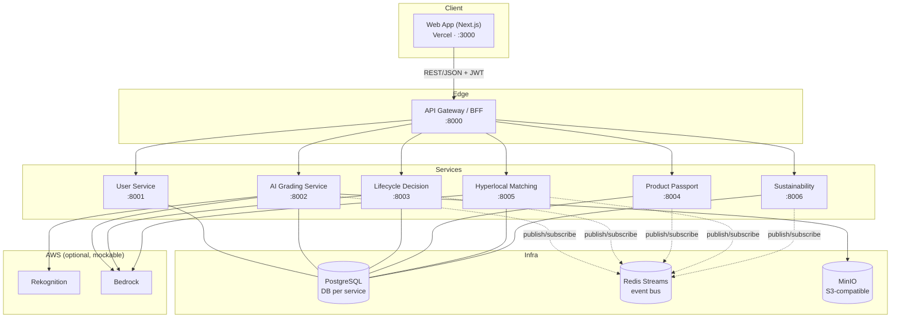
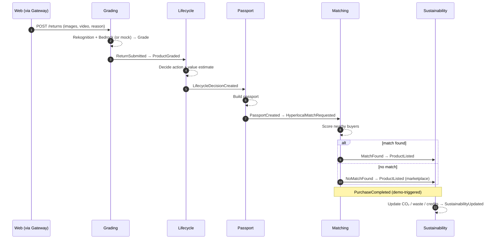

# Architecture — Amazon Second Life AI

>**Audience:** AI agents and engineers building the system. This is the authoritative
> description of services, data, events, and infrastructure. If code and this document
> disagree, update **both** so they re-converge. Read this before writing any code.

---

## 1. System Overview

Amazon Second Life AI is an event-driven **microservices** platform that decides the most
valuable, most sustainable "next life" for every returned product. A return enters the
system, is graded by AI, routed by a lifecycle decision engine, given a digital passport,
matched to a nearby buyer (or listed in a refurbished marketplace), and finally accounted
for in a sustainability ledger.

### Design principles

1.**Contract-first.** OpenAPI schemas and event envelopes are defined in Phase 0. Members
 build against contracts, not implementations, so the three of us work in parallel.
2.**Services own their data.** No service reads another service's database. Cross-service
 data is obtained via REST (synchronous) or events (asynchronous).
3.**Event-decoupled saga.** The end-to-end flow is choreographed through events on a Redis
 stream. No central orchestrator; each service reacts to events and emits the next one.
4.**AI is abstracted.** All AWS Bedrock / Rekognition calls go through one shared client
 wrapper with a deterministic **mock mode** so the system runs and demos without AWS keys.
5.**Hybrid infra.** Everything runs locally via Docker Compose (Postgres, Redis, MinIO).
 Only the AI calls reach the cloud (and even those are optional via mock mode). The
 frontend deploys to Vercel.

---

## 2. Technology Stack

| Layer | Technology | Notes |
|------------------|---------------------------------------------------------|-------|
| Frontend | Next.js 14 (App Router), React 18, TypeScript 5 | Deploys to Vercel |
| Styling | Tailwind CSS 3.4, shadcn/ui (Radix primitives), CVA | Tokens in `tailwind.config.ts` |
| Data fetching | TanStack Query 5, Zod, React Hook Form | Typed API client |
| Charts / icons | Recharts 2, lucide-react | Sustainability dashboard |
| Backend | Python 3.12, FastAPI 0.115, Pydantic 2 | One app per service |
| ORM / DB driver | SQLAlchemy 2.0 (async), asyncpg, Alembic | DB-per-service |
| Database | PostgreSQL 16 | One DB per service, single container |
| Event bus | Redis 7 (Streams + consumer groups) | Behind shared `events` wrapper |
| Object storage | MinIO (S3-compatible) | Product images/videos |
| AI | AWS Bedrock (reasoning/summaries) + Rekognition (vision)| Behind shared `ai` wrapper + mock |
| Auth | JWT (python-jose), passlib[bcrypt] | Issued by User Service |
| Packaging / dev | Docker, Docker Compose, uv/pip, npm | Local-first |
| Quality | ruff + black (Py), eslint + prettier (TS), pytest/vitest| See code-standards.md |

>**Version pins live in [library-docs.md](library-docs.md).** Do not introduce a library
> that is not listed there without adding it to that file first.

---

## 3. Service Catalog

Seven backend services + one frontend. Each backend service is an independent FastAPI app
with its own database, Dockerfile, and port. **Owner** indicates the responsible member
(A = Full-Stack, B = AI & Backend, C = Frontend).

| Service | Owner | Port | Database | Responsibility |
|---------|-------|------|----------|----------------|
| **API Gateway / BFF** (`gateway`) | A | 8000 | `slmai_gateway` | Single entry point for the frontend; routes/aggregates calls to services; verifies JWTs; owns Return entity; exposes a read-model for dashboards. |
| **User Service** (`user`) | A | 8001 | `slmai_user` | Auth (register/login/JWT), user profile, preferences, green-credit balance. |
| **AI Grading Service** (`grading`) | B | 8002 | `slmai_grading` | Analyze images/video + return reason → condition grade, confidence, damage summary. Emits `ProductGraded`. |
| **Lifecycle Decision Service** (`lifecycle`) | B | 8003 | `slmai_lifecycle` | Decide next action (Resell / Refurbish / Donate / Recycle / Hyperlocal) + value-recovery estimate. Emits `LifecycleDecisionCreated`. |
| **Product Passport Service** (`passport`) | A | 8004 | `slmai_passport` | Build & store the digital product passport (grade, ownership, refurb, sustainability history). Emits `PassportCreated`. |
| **Hyperlocal Matching Service** (`matching`) | B | 8005 | `slmai_matching` | Find nearby buyers (reads buyer candidates from the User service via REST), score matches, estimate logistics savings. Emits `MatchFound` / `NoMatchFound` and `ProductListed`. |
| **Sustainability Service** (`sustainability`) | B | 8006 | `slmai_sustainability` | CO₂ avoided, waste diverted, value recovered, green credits; serves dashboard metrics. Consumes `SustainabilityUpdated` triggers. |
| **Web Frontend** (`apps/web`) | C | 3000 | _none_ | Next.js UI for all five features; talks **only** to the Gateway. |

>**Analytics** from the PRD is intentionally folded into the Sustainability service
> (metrics) and the Gateway read-model (operational aggregates) to keep the weekend scope
> realistic. Do not create a separate analytics service.

### Service responsibility boundaries (do / don't)

- A service **may** call another service's public REST API through the Gateway contract or
 directly by service URL for server-to-server reads (e.g. Passport reading a Grade).
- A service **must not** open a DB connection to another service's database.
- Long-running / fan-out work (the saga) is driven by **events**, not synchronous chains.
- The frontend **must not** call individual services directly — only the Gateway.

---

## 4. High-Level Architecture



---

## 5. Domain Model

Core entities. Each lives in exactly one service's database. IDs are UUID v4 strings.
`correlation_id` (a.k.a. the **return/saga id**) threads one return through every service.

| Entity | Owner service | Key fields |
|--------|---------------|-----------|
| `User` | user | id, email, password_hash, display_name, location (lat/lng/city), interests[], green_credits, created_at |
| `Product` | passport | id, owner_user_id, category, title, brand, attributes(json), created_at |
| `Return` | gateway | id (=correlation_id), product_id, user_id, reason, media[] (S3 keys), status, created_at |
| `Grade` | grading | id, return_id, product_id, grade(A/B/C/D), confidence(0–1), damage_summary, defects[], model_meta, created_at |
| `LifecycleDecision` | lifecycle | id, return_id, grade_id, action(enum), rationale, value_recovery_estimate, sustainability_score, created_at |
| `Passport` | passport | id, product_id, return_id, current_grade, ownership_history[], refurb_history[], sustainability(json), status, created_at |
| `MatchRequest` | matching | id, return_id, product_id, category, location, status, created_at |
| `Match` | matching | id, match_request_id, buyer_user_id, score, estimated_savings, distance_km |
| `Listing` | matching | id, product_id, passport_id, price, channel(hyperlocal/marketplace), status, created_at |
| `SustainabilityRecord` | sustainability | id, return_id, product_id, co2_avoided_kg, waste_diverted_kg, value_recovered, green_credits, created_at |

>**Enums** (`Grade`, `LifecycleAction`, `Return.status` — incl. `FAILED`, `Listing.channel/status`)
> are defined once in `packages/shared-py` and mirrored in `apps/web/types`. See
> [code-standards.md](code-standards.md) §"Shared enums & contracts".
>
>**Creation & read seams (no cross-service DB access):** the **Gateway** creates the `Return`
> on `POST /returns`; the **Passport** service owns the canonical `Product`; the **Matching**
> service never reads the User DB — it fetches buyer candidates from the **User** service via
> REST (`GET /users/candidates?category=&lat=&lng=`).

---

## 6. Event Flow (the saga)

The PRD event chain is implemented as a **choreographed saga** over a single Redis stream
`slmai:events`. Each service joins a consumer group, filters by `event_type`, processes,
and emits the next event. `correlation_id` = the `Return.id`.



### Event envelope (every message)

```json
{
 "event_id": "uuid",
 "event_type": "ProductGraded",
 "event_version": "1.0",
 "occurred_at": "2026-06-13T10:00:00Z",
 "correlation_id": "<return id>",
 "producer": "grading-service",
 "data": { "...event-specific payload..." }
}
```

### Event catalog

| # | `event_type` | Producer | Primary consumer(s) | `data` payload (summary) |
|---|--------------|----------|---------------------|--------------------------|
| 1 | `ReturnSubmitted` | gateway/grading | grading | return_id, product_id, user_id, reason, media[] |
| 2 | `ProductGraded` | grading | lifecycle, passport | return_id, grade, confidence, damage_summary |
| 3 | `LifecycleDecisionCreated` | lifecycle | passport, matching | return_id, action, value_recovery_estimate, sustainability_score |
| 4 | `PassportCreated` | passport | matching | passport_id, product_id, return_id |
| 5 | `HyperlocalMatchRequested` | passport/matching | matching | return_id, product_id, category, location |
| 6 | `MatchFound` | matching | sustainability, passport | return_id, buyer_user_id, score, estimated_savings |
| 7 | `NoMatchFound` | matching | sustainability | return_id, reason |
| 8 | `ProductListed` | matching | sustainability | listing_id, channel, price |
| 9 | `PurchaseCompleted` | matching/gateway | sustainability, passport | listing_id, buyer_user_id, price |
| 10 | `SustainabilityUpdated` | sustainability | gateway (read-model) | return_id, co2_avoided_kg, waste_diverted_kg, green_credits |

> The shared `events` package exposes `publish(event_type, correlation_id, data)` and a
> `subscribe(group, handler)` decorator. **Never** call Redis directly from a service —
> always go through the wrapper so the envelope, stream name, and consumer-group semantics
> stay consistent. Handlers must be **idempotent** (dedupe on `event_id`). On repeated handler
> failure the wrapper retries, then routes the message to a **dead-letter stream**
> (`slmai:events:dlq`); the owning service marks the affected `Return` as `FAILED` so the saga
> stops cleanly instead of silently stalling.

---

## 7. AI Integration

All AI runs behind one shared client (`packages/shared-py/ai`) with three modes selected by
the `AI_MODE` env var: `mock` (default, deterministic, no network), `aws` (real Bedrock +
Rekognition), `hybrid` (Rekognition for vision, Bedrock for reasoning; mock the rest).

| Capability | Service | AWS service | Mock behavior |
|------------|---------|-------------|---------------|
| Image label / defect cues | grading | Rekognition `DetectLabels` / `DetectModerationLabels` | Deterministic labels seeded from media filename hash |
| Video condition cues | grading | Rekognition Video (or sampled frames) | Same deterministic seeding |
| Grade + damage summary | grading | Bedrock (Claude / Titan text) | Rule-based grade from seed + templated summary |
| Lifecycle rationale | lifecycle | Bedrock | Deterministic decision table by grade + category |
| Match rationale | matching | Bedrock | Templated rationale from score |

Rules:
-**Routers never import boto3.** They call the `ai` wrapper, which returns typed Pydantic
 results. This keeps mock/real swapping trivial and keeps prompts in one place.
- Prompts live in `packages/shared-py/ai/prompts/` and are versioned. See
 [library-docs.md](library-docs.md) → boto3 / Bedrock.
- The wrapper must **degrade gracefully**: on AWS error or timeout, log and fall back to
 mock so a demo never hard-fails.

---

## 8. Cross-Cutting Concerns

| Concern | Approach |
|---------|----------|
| **Config** | `pydantic-settings`; every service reads env vars; `.env.example` is the contract. Never hardcode secrets/URLs. |
| **Auth** | User Service issues JWT (HS256, shared `JWT_SECRET`). Gateway verifies and forwards `X-User-Id`. Services trust the Gateway header on the internal network. |
| **Correlation** | `correlation_id` (return id) is propagated in every event and as an `X-Correlation-Id` header across REST calls; included in all logs. |
| **Logging** | Structured JSON logs (one line per event) via shared logger; include `service`, `correlation_id`, `event_id`. |
| **Health** | Every service exposes `GET /health` (liveness) and `GET /ready` (DB + Redis reachable). |
| **Errors** | Consistent error envelope `{ "error": { "code", "message", "correlation_id" } }`. HTTP status per [code-standards.md](code-standards.md). |
| **Cross-service reads** | Never query another service's DB. Read via REST through typed clients (e.g. Matching → User `GET /users/candidates`). Gateway creates the `Return`; Passport owns the canonical `Product`. |
| **Failure handling** | Events wrapper retries then dead-letters to `slmai:events:dlq`; the owning service sets `Return.status = FAILED`; the UI surfaces a non-blocking error state. |
| **Migrations** | Alembic per service; `alembic upgrade head` on container start (dev). |
| **CORS** | Gateway allows the web origin; internal services are not exposed publicly. |

---

## 9. Repository Layout (monorepo)

```text
az-second-life-ai/
├── AGENTS.md # entry point for agents — read first
├── README.md
├── docker-compose.yml # postgres, redis, minio, all services
├── .env.example # the config contract (copy to .env)
├── docs/
│ ├── architecture.md # this file
│ ├── build-plan.md
│ ├── progress-tracker.md
│ ├── code-standards.md
│ ├── library-docs.md
│ ├── ui-rules.md
│ ├── ui-tokens.md
│ └── ui-registry.md
├── packages/
│ └── shared-py/ # installable shared lib for all Python services
│ ├── events/ # publish/subscribe wrapper + envelope
│ ├── ai/ # Bedrock/Rekognition wrapper + mock + prompts
│ ├── config/ # base settings, logging
│ ├── schemas/ # shared enums & event payload models
│ └── web/ # base FastAPI app factory, health, error handlers
├── services/
│ ├── gateway/ # A · :8000
│ ├── user/ # A · :8001
│ ├── grading/ # B · :8002
│ ├── lifecycle/ # B · :8003
│ ├── passport/ # A · :8004
│ ├── matching/ # B · :8005
│ └── sustainability/ # B · :8006
├── apps/
│ └── web/ # C · Next.js · :3000
└── scripts/
 ├── seed.py # demo users, products, sample returns
 └── dev.ps1 / dev.sh # bring up the stack
```

### Per-service layout (FastAPI)

```text
services/<name>/
├── app/
│ ├── main.py # create_app() from shared base
│ ├── config.py # service Settings(BaseSettings)
│ ├── api/routes.py # APIRouter(s)
│ ├── domain/
│ │ ├── models.py # SQLAlchemy models
│ │ ├── schemas.py # Pydantic request/response DTOs
│ │ └── service.py # business logic (no FastAPI imports)
│ ├── db/session.py # async engine/session
│ ├── db/repository.py # data access
│ └── events/handlers.py # event consumers (idempotent)
├── tests/
├── alembic/ + alembic.ini
├── pyproject.toml
└── Dockerfile
```

### Frontend layout

```text
apps/web/
├── app/ # App Router routes (returns, passport, matches, marketplace, sustainability)
├── components/ui/ # design-system primitives (the registry source)
├── components/features/ # feature-level composites
├── lib/api/ # typed Gateway client
├── lib/hooks/ # TanStack Query hooks
├── lib/utils.ts # cn(), formatters
├── types/ # TS mirror of backend DTOs/enums
├── tailwind.config.ts # consumes ui-tokens.md
└── package.json
```

---

## 10. Deployment Topology

| Environment | What runs where |
|-------------|-----------------|
| **Local (primary)** | `docker compose up` → Postgres, Redis, MinIO, all 7 backend services. Web runs `npm run dev` (or in compose). `AI_MODE=mock` by default. |
| **Demo** | Frontend on **Vercel** (`apps/web`), pointing at the Gateway URL via `NEXT_PUBLIC_API_BASE_URL`. Backend stays local (tunnel) or on a single cloud VM. `AI_MODE=aws` or `hybrid` if AWS keys are present. |
| **AI** | AWS Bedrock + Rekognition reached directly from `grading`/`lifecycle`/`matching` via the shared wrapper. Optional; mock covers the demo if keys are absent. |

### Ports summary

| 3000 web · 8000 gateway · 8001 user · 8002 grading · 8003 lifecycle · 8004 passport · 8005 matching · 8006 sustainability · 5432 postgres · 6379 redis · 9000/9001 minio |

---

## 11. Open Decisions & Assumptions

- Single Postgres container hosts one **database per service** (logical isolation without 6
 containers). Acceptable trade-off for a 24–48h build; the no-cross-DB rule still holds.
- Redis **Streams** chosen over Pub/Sub for at-least-once delivery + replay; hidden behind
 the `events` wrapper so it can be swapped.
- `PurchaseCompleted` is **demo-triggered** (a button) rather than a real checkout.
- Geospatial matching uses simple Haversine distance on stored lat/lng — no PostGIS.

> When any assumption changes, update this section **and** the affected file
> (build-plan, code-standards, or library-docs).