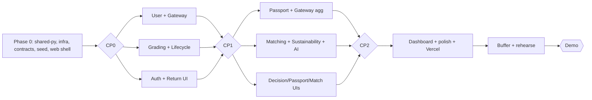

# Build Plan — Amazon Second Life AI

>**Phase-wise parallel build plan for a 3-person, 24–48h hackathon.** Each task has a stable
> ID (`P<phase>-<member><n>`). [progress-tracker.md](progress-tracker.md) mirrors these IDs
> 1:1 — when you finish a task, update its row there. Read [architecture.md](architecture.md)
> and [code-standards.md](code-standards.md) before starting any task.

---

## Members & Ownership

| Member | Role | Primary surface |
|--------|------|-----------------|
| **A** | Full-Stack Developer | Infra, shared packages, Gateway, User, Passport, event wiring, DB, Docker Compose, full demo seed, dev scripts |
| **B** | AI & Backend Engineer | AI wrapper (Bedrock/Rekognition/mock), Grading, Lifecycle, Matching, Sustainability, prompts, scoring, minimal seed/fixtures, event-saga observability tooling |
| **C** | Frontend Engineer | Next.js app, design system (tokens + registry), all 5 feature UIs, Vercel deploy |

### Service → owner (every service is owned)

| gateway → A · user → A · passport → A · grading → B · lifecycle → B · matching → B · sustainability → B · web → C |

---

## Phase Overview & Timeline (guideline for 48h)

| Phase | Theme | Goal | Rough window |
|-------|-------|------|--------------|
| **0** | Foundation & Contracts | Everyone unblocked to build in parallel | 0–6h |
| **1** | Core Services & Vertical Slice | Register → submit return → grade → decision works | 6–20h |
| **2** | Integration & Remaining Services | Full event saga across all services, visible in UI | 20–34h |
| **3** | Dashboard, Polish & Demo | Sustainability dashboard, polish, Vercel, rehearse | 34–44h |
| **Buffer** | Contingency & Rehearsal | Integration bugs, demo rehearsal, rest | 44–48h |

Integration **checkpoints** (CP0–CP3) gate each phase: do not start the next phase's
integration tasks until the checkpoint is green. The **~4h buffer** is deliberate slack — do
not plan work into it; it absorbs overruns and protects the rehearsal.

---

## Dependency Graph (high level)

---

## Phase 0 — Foundation & Contracts

>**Outcome:** the monorepo boots; shared packages, infra, contracts, and the web shell exist
> so all three members can work against stable seams. **Do Phase 0 tasks first** — they
> unblock everything.

| ID | Owner | Task | Deliverable | Depends on |
|----|-------|------|-------------|-----------|
| **P0-A1** | A | Monorepo scaffold | Folder structure per [architecture.md](architecture.md) §9, root `README.md`, `.gitignore`, `.env.example` (config contract) | — |
| **P0-A2** | A | Local infra via Docker Compose | `docker-compose.yml` with Postgres 16 (multi-DB init script: `slmai_user/grading/lifecycle/passport/matching/sustainability`), Redis 7, MinIO; healthchecks | P0-A1 |
| **P0-A3** | A | shared-py base web | `create_app()` factory: health/`ready`, JSON error envelope, structured logging, CORS, settings base | P0-A1 |
| **P0-A4** | A | shared-py events wrapper | Redis Streams `publish()` + `@subscribe()` over `slmai:events`, envelope builder, idempotency/`event_id` dedupe; **retry → dead-letter** (`slmai:events:dlq`) after repeated handler failure | P0-A3 |
| **P0-A5** | A | Shared contracts (+ REST + cross-service reads) | `shared-py/schemas`: enums (Grade, LifecycleAction, ReturnStatus **incl. `FAILED`**, ListingChannel/Status) + event payload models; **per-service REST/OpenAPI stubs** (endpoint list + req/resp models); **cross-service read contracts** — Matching→User `GET /users/candidates?category=&lat=&lng=`, Gateway creates `Return`, Passport owns `Product`; mirror in `apps/web/types`; commit event catalog | P0-A1 |
| **P0-B1** | B | shared-py AI wrapper (mock) | `ai` package: typed `analyze_media/summarize_damage/decide_lifecycle/match_rationale` + convenience `grade_product`; deterministic **mock mode** (seeded from media key hash, golden-path constant `GOLDEN_PATH_MEDIA_KEY`); `AI_MODE` + `BEDROCK_MODEL_ID` env config; prompt scaffolding in `ai/prompts/`; `correlation_id` in all structured logs | P0-A3 |
| **P0-B2** | B | Minimal seed/fixtures | `scripts/seed_min.py`: demo users (location + interests), products, a couple of sample returns — usable by **B** (AI tuning) and **C** (real UIs) from Phase 0 | P0-A2, P0-A5 |
| **P0-B3** | B | Event-saga observability | `scripts/events_tail.py` (tail `slmai:events` + DLQ), Gateway `/debug/events` read view (added in coordination with **A**, the gateway owner), manual event **trigger/replay** helper | P0-A4 |
| **P0-C1** | C | Web scaffold + tokens + IA | Next.js 14 (App Router, TS, pnpm) + Tailwind; `globals.css` CSS vars + `tailwind.config.ts` from [ui-tokens.md](ui-tokens.md); Inter via `next/font`; **route map / IA**: `/login`, `/returns`, `/returns/[id]`, `/passport/[id]`, `/matches`, `/marketplace`, `/sustainability` | P0-A1 |
| **P0-C2** | C | Primitives batch 1 + shell | `cn()`, QueryClient provider, `AppShell`/`NavBar`, primitives: Button, Card, Badge, Input, Label, Skeleton → register in [ui-registry.md](ui-registry.md) | P0-C1 |
| **P0-C3** | C | Frontend mock layer + API client | typed Gateway API client + Zod response schemas mirroring `P0-A5`; **mock layer** (MSW or static fixtures) so UI builds before endpoints land | P0-C1, P0-A5 |

>**✅ Checkpoint CP0:** `docker compose up` starts infra + a sample service `/health` returns
> 200; `seed_min` loads; `pnpm dev` renders the shell (tokens) against the mock layer. Enums +
> REST contracts exist in both stacks. Event publish/subscribe round-trips a test message, and a
> repeatedly-failing handler lands in the DLQ.

---

## Phase 1 — Core Services & Vertical Slice

>**Outcome:** a real vertical slice — a user registers, submits a return, and sees an AI
> grade and a lifecycle decision, all through the Gateway with mock AI.

| ID | Owner | Task | Deliverable | Depends on |
|----|-------|------|-------------|-----------|
| **P1-A1** | A | User Service | register/login → JWT (HS256), profile, preferences, green-credit balance; Alembic; tests | P0-A3, P0-A5 |
| **P1-A2** | A | API Gateway + Returns intake | JWT verify + `X-User-Id` passthrough + CORS; `POST /returns` (create Return, upload media → MinIO, emit `ReturnSubmitted`); route map to services | P0-A3, P0-A4, P1-A1 |
| **P1-B1** | B | AI Grading Service | consume `ReturnSubmitted` → Rekognition+Bedrock (or mock) → `Grade` (grade/confidence/damage); emit `ProductGraded`; `GET /grades`; Alembic; tests | P0-A4, P0-B1 |
| **P1-B2** | B | Lifecycle Decision Service | consume `ProductGraded` → decision table + Bedrock rationale → action + value estimate + sustainability score; emit `LifecycleDecisionCreated`; endpoints; Alembic | P0-A4, P0-B1, P1-B1 |
| **P1-C1** | C | Auth UI + client | login/register pages (RHF + Zod), auth store, JWT wired into API client | P0-C2, P1-A1 |
| **P1-C2** | C | Return submission + grade view | `FileUpload` + reason form → Gateway; grading **progress** state; `GradePanel` (`GradeBadge`, confidence `Progress`, damage list) | P0-C2, P1-A2, P1-B1 |
| **P1-C3** | C | Primitives batch 2 | Select, Tabs, Dialog, Progress, Toast/Toaster, Tooltip + `EmptyState`/`ErrorState`/`PageHeader`; register all | P0-C2 |

>**✅ Checkpoint CP1:** End-to-end through the Gateway: register → submit return → see grade
>+ lifecycle decision (mock AI). Events `ReturnSubmitted → ProductGraded →
> LifecycleDecisionCreated` observed on the stream.

---

## Phase 2 — Integration & Remaining Services

>**Outcome:** the full choreographed saga runs across all seven services and every step is
> visible in the UI.

| ID | Owner | Task | Deliverable | Depends on |
|----|-------|------|-------------|-----------|
| **P2-A1** | A | Product Passport Service | consume `ProductGraded` + `LifecycleDecisionCreated` → build passport; emit `PassportCreated` + `HyperlocalMatchRequested`; `GET /passports/{id}`; Alembic | P1-B1, P1-B2 |
| **P2-A2** | A | Gateway aggregation + purchase | aggregate passport/matches/marketplace for the BFF; `POST /purchase` (demo) → emit `PurchaseCompleted` | P2-A1, P2-B1 |
| **P2-B1** | B | Hyperlocal Matching Service | consume `HyperlocalMatchRequested` → fetch buyer candidates via REST from User (`GET /users/candidates`) → Haversine scoring + Bedrock rationale → emit `MatchFound`/`NoMatchFound` + `ProductListed`; endpoints; Alembic | P2-A1, P1-A1 |
| **P2-B2** | B | Sustainability Service | consume `MatchFound`/`ProductListed`/`PurchaseCompleted` → CO₂/waste/value/credits calc; emit `SustainabilityUpdated`; metrics endpoints; Alembic | P0-A4, P2-B1 |
| **P2-B3** | B | Real AI path | validate `AI_MODE=aws`/`hybrid` (Bedrock + Rekognition), tune prompts in `ai/prompts/`, confirm graceful fallback to mock | P1-B1, P1-B2 |
| **P2-B4** | B | Decision & score tuning | value-recovery estimate + sustainability score logic across grades/categories | P1-B2, P2-B2 |
| **P2-C1** | C | Lifecycle decision UI | `DecisionCard` (action color, rationale, value `StatCard`) wired to Gateway | P1-B2, P1-C3 |
| **P2-C2** | C | Passport UI | `PassportTimeline` + ownership/refurb/sustainability history wired to Gateway | P2-A1, P1-C3 |
| **P2-C3** | C | Matching + marketplace UI | `MatchCard` list + `ProductCard` marketplace; match/no-match banner | P2-B1, P2-A2, P1-C3 |

>**✅ Checkpoint CP2:** A single return flows `ReturnSubmitted → ProductGraded →
> LifecycleDecisionCreated → PassportCreated → HyperlocalMatchRequested →
> MatchFound/NoMatchFound → ProductListed → PurchaseCompleted → SustainabilityUpdated`, and
> each stage is viewable in the UI.

---

## Phase 3 — Dashboard, Polish & Demo

>**Outcome:** sustainability dashboard complete, app polished and responsive, frontend on
> Vercel, demo rehearsed.

| ID | Owner | Task | Deliverable | Depends on |
|----|-------|------|-------------|-----------|
| **P3-A1** | A | Seed + demo wiring | `scripts/seed.py` (full demo narrative on top of `seed_min`); Gateway read-model/aggregates for dashboard; demo `PurchaseCompleted` trigger | P0-B2, P2-A2, P2-B2 |
| **P3-A2** | A | E2E smoke + failure path + hardening | full `docker compose up` smoke pass; **saga failure-path test** (return that fails grading → `FAILED`, no stall, lands in DLQ); fix integration gaps; finalize `.env.example` + run docs | CP2 |
| **P3-B1** | B | Sustainability metrics finalize | totals, green-credit accrual, dashboard data endpoints | P2-B2 |
| **P3-B2** | B | Golden-path demo + AI fallback test | lock the deterministic **golden-path demo product** (grade→decision→match→sustainability); verify fallback path with keys absent | P2-B3 |
| **P3-C1** | C | Sustainability Dashboard | `StatCard` row (CO₂, waste, value, credits) + `ChartCard`s (Recharts, chart tokens) | P2-B2, P1-C3 |
| **P3-C2** | C | Polish + states + a11y | loading/empty/error across all pages; responsive pass; accessibility checklist | CP2 |
| **P3-C3** | C | Vercel deploy | deploy `apps/web`, set `NEXT_PUBLIC_API_BASE_URL`, final visual polish | P3-C1, P3-C2 |

>**✅ Checkpoint CP3 (Demo-ready):** the judge happy path below runs without manual patching.

---

## Integration Checkpoints (summary)

| CP | Gate | Owner to verify |
|----|------|-----------------|
| **CP0** | Infra boots; shell + tokens render; events round-trip; enums in both stacks | A |
| **CP1** | Register → return → grade → decision (mock) end-to-end via Gateway | A + B + C |
| **CP2** | Full 10-event saga runs; each step visible in UI | A + B + C |
| **CP3** | Demo happy path rehearsed; Vercel live; fallback verified | All |

At each checkpoint, the three members sync, run the flow together, and only then pick up the
next phase's integration-dependent tasks.

---

## Demo Script (judge happy path)

1.**Login** as a demo customer (seeded).
2.**Submit a return**: upload product images/video + pick a return reason.
3. Watch **AI Grading** produce a grade (A/B/C/D), confidence, and damage summary.
4. See the **Lifecycle Decision** (e.g. "Refurbish") with rationale + value-recovery estimate.
5. Open the **Digital Product Passport** timeline (graded → decided → passported).
6. View **Hyperlocal Matches** — nearby buyers, score, estimated logistics savings.
7. Trigger **Purchase Completed** (demo button) → product marked sold.
8. Open the **Sustainability Dashboard**: CO₂ avoided, waste diverted, value recovered, green
 credits update live.
9. Mention the **mock-vs-AWS** toggle (`AI_MODE`) — same demo runs with real Bedrock +
 Rekognition or fully offline.

---

## Parallelization Rules (avoid collisions)

-**Own your folders.** A: `services/{gateway,user,passport}` + `packages/shared-py`
 (events/config/web/schemas) + infra + `scripts/seed.py` + dev bring-up scripts. B:
 `services/{grading,lifecycle,matching,sustainability}` + `packages/shared-py/ai` +
 `scripts/{seed_min.py,events_tail.py}` (seed + observability tooling). C: `apps/web`.
 **Note:** `scripts/` is shared at the file level — B owns `seed_min.py` + `events_tail.py`,
 A owns the full demo `seed.py` and dev scripts; the Gateway `/debug/events` read view lives in
 A's `gateway` and is added by B in coordination with A.
-**Contracts before code.** Any change to an enum, event payload, or Gateway route is a
 contract change — announce it, update [code-standards.md](code-standards.md) §4 /
 [architecture.md](architecture.md) §6, and bump both stacks.
-**Mock everything you don't own yet.** Frontend builds against typed mocks until the Gateway
 endpoint lands; services emit/consume real events from CP0 onward.
-**Small PRs per task ID.** Branch `<member>/<area>/<task-id>`; PR title references the task
 ID; update [progress-tracker.md](progress-tracker.md) in the same PR.

---

## Risk Buffer / Cut Lines (if time runs short)

Drop in this order to protect the demo:
1. Dark theme (already a stretch).
2. Real AWS path (rely on mock) — keep `AI_MODE=mock`.
3. Marketplace `ProductCard` page (passport + matches are enough to tell the story).
4. Video analysis (images-only grading).

Never cut: the event saga spine, grading→decision→passport→match, and the sustainability
dashboard — these are the story.